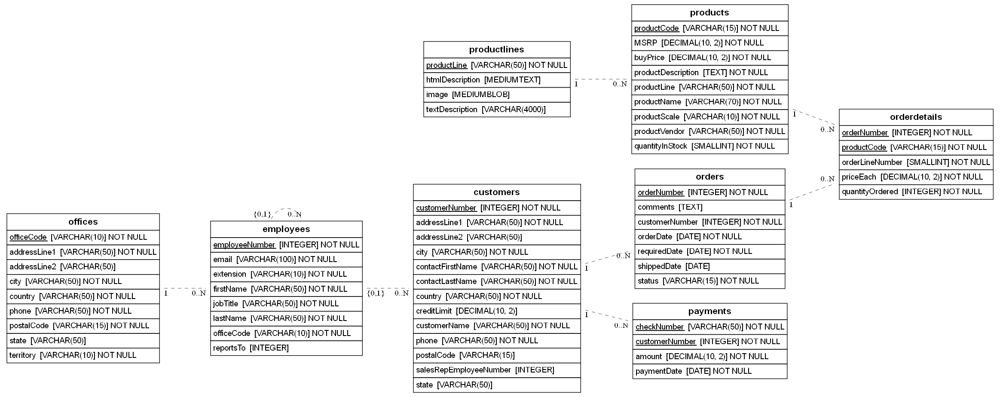
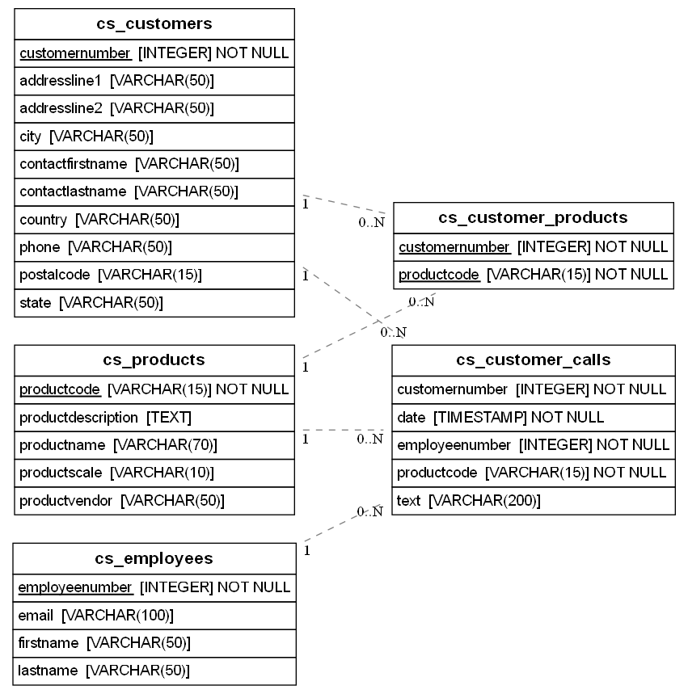
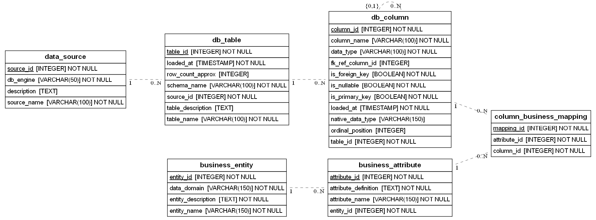

# Proyecto Final — Modelos y Persistencia de Datos

**Pontificia Universidad Javeriana — Modelado y persistencia de datos — 2026-01**

Elaborado por: Luis Daniel Sierra Pineda, David Cortes, Salomón Saenz

## Arranque rápido

Todo el proyecto corre en local, sin cuentas en la nube ni credenciales. Solo hacen falta **Docker** y **Python 3.9 o superior**.

```bash
git clone <url-del-repositorio>
cd PROYECTOFINAL_MODELOS_Y_PERSISTENCIA_DE_DATOS_SALUDA
python run_all.py
```

Eso es todo. El script levanta las dos fuentes, el repositorio de metadatos, el almacén de datos y Metabase; restaura las bases desde los dumps de `sources/`; y ejecuta el pipeline completo de las dos entregas. Funciona igual en Windows, macOS y Linux.

Cuando termina:

| Qué | Dónde | Acceso |
|---|---|---|
| Reportes (Metabase) | http://localhost:3000 | `grupo@javeriana.edu.co` / `Javeriana2026!` |
| Almacén de datos | `localhost:5434`, base `dw` | `postgres` / `javeriana` |
| Repositorio de metadatos | `localhost:5434`, base `metadata` | `postgres` / `javeriana` |
| classicmodels (MySQL) | `localhost:3307` | `root` / `javeriana` |
| customerservice (PostgreSQL) | `localhost:5433` | `postgres` / `javeriana` |

Otros comandos:

```bash
python run_all.py --apagar     # apaga el stack sin perder datos
python run_all.py --reiniciar  # borra los datos y empieza de cero
python run_all.py --solo-etl   # no toca Docker, solo recarga los datos
```

> La primera ejecución tarda varios minutos: descarga las imágenes de Docker y MySQL restaura `classicmodels` al arrancar. Las siguientes son mucho más rápidas.

## Estado del proyecto

| Entrega | Qué construye | Documento |
|---|---|---|
| **Entrega 1** | Descubrimiento, perfilamiento y repositorio de metadatos sobre las dos fuentes | [`Documento_Entrega_1.md`](docs/Entrega_1/Documento_Entrega_1.md) |
| **Entrega 2** | Almacén de datos dimensional, ETL, metadatos del almacén y reportes | [`Documento_Entrega_2.md`](docs/Entrega_2/Documento_Entrega_2.md) |

Para la Entrega 2 hay además:

- [Las capas de la solución](docs/Entrega_2/CAPAS.md) — referencia rápida de la arquitectura por capas y los principios que la sustentan
- [Plan de ejecución](docs/Entrega_2/PLAN.md)
- [Guía paso a paso](docs/Entrega_2/GUIA_PASO_A_PASO.md) — pensada para quien nunca ha construido un almacén de datos

## 1. Objetivo del proyecto

El proyecto integra dos fuentes de datos de una organización —una base de datos transaccional de ventas y una base de datos de atención al cliente— e implementa primero la capa de persistencia de un repositorio de metadatos (Entrega 1) y después una solución de Inteligencia de Negocios sobre ambas (Entrega 2).

La **Entrega 1** se estructuró según su enunciado ([`Proyecto - Entrega 1.pdf`](docs/enunciados/Proyecto%20-%20Entrega%201.pdf)) en cuatro frentes: Descubrimiento de Metadatos, Perfilamiento de Datos, Repositorio de Metadatos y Consultas.

La **Entrega 2** ([`Proyecto - Entrega 2.pdf`](docs/enunciados/Proyecto%20-%20Entrega%202.pdf)) construye sobre eso un almacén dimensional en constelación: `fact_ventas` al grano de línea de orden y `fact_llamadas_servicio` al grano de llamada, unidos por las dimensiones conformadas `dim_cliente`, `dim_producto` y `dim_tiempo`. Esa conformación es lo que permite responder la pregunta que ninguna fuente contesta sola: **qué productos generan más llamadas de servicio por unidad vendida**.


## 2. Fuentes de datos

### 2.1 classicmodels (MySQL)

Base de datos transaccional que soporta el proceso de ventas de la compañía: clientes, empleados/representantes de ventas, oficinas, órdenes de compra (encabezado y detalle), pagos y el catálogo de productos organizado por líneas. El respaldo de esta base se encuentra en [`sources/mysqlsampledatabase.sql`](sources/mysqlsampledatabase.sql).

Diagrama entidad-relación de classicmodels (generado con eralchemy2):



### 2.2 customerservice (PostgreSQL)

Base de datos del centro de atención al cliente: registra las llamadas de servicio, relacionando cada llamada con el empleado que la atendió, el cliente que llamó y el producto sobre el cual se hizo la consulta, además de un catálogo de clientes, empleados y productos propio de este sistema. El respaldo de esta base se encuentra en [`sources/customerservice.sql`](sources/customerservice.sql).

Diagrama entidad-relación de customerservice (generado con eralchemy2):



## 3. Descubrimiento y perfilamiento

Sobre ambas fuentes se documentaron los metadatos técnicos (tablas, columnas, tipos de dato, llaves primarias y foráneas) y las reglas de negocio implícitas en ellas, identificando las estructuras que las dos fuentes tienen en común (clientes, empleados, productos) frente a las que son exclusivas de cada una. Adicionalmente se perfiló cada columna de las 13 tablas —rangos de valores, patrones de texto, porcentaje de nulos, integridad referencial y correspondencia/duplicados entre las estructuras comunes—, incluyendo un algoritmo de descubrimiento de relaciones implícitas entre columnas de las dos bases de datos, que no pueden declararse como llave foránea real por pertenecer a motores distintos. Los datos crudos que soportan este análisis quedaron en la carpeta [`output/`](profiling/output/) (`metadata_tecnico.csv`, `perfilamiento.csv`, `relaciones_fk.csv`, `correspondencia_entidades.csv`, `relaciones_inferidas.csv`) y los reportes de perfilamiento generados con `ydata-profiling` en [`profiling/reports/`](profiling/reports/), [`profiling/reports_mysql/`](profiling/reports_mysql/) y [`profiling/reports_comparacion/`](profiling/reports_comparacion/).

## 4. Repositorio de metadatos

El repositorio se diseñó como una base de datos relacional en PostgreSQL, alojada en un servicio independiente de Railway, compuesta por seis tablas: tres para el metadato técnico (`data_source`, `db_table`, `db_column`), dos para el metadato de negocio (`business_entity`, `business_attribute`), más una tabla puente (`column_business_mapping`) que materializa el linaje semántico conectando cada columna técnica con su atributo de negocio correspondiente.

La arquitectura del repositorio es **híbrida**, siguiendo el marco DAMA-DMBOK: a nivel conceptual es distribuida, pues classicmodels y customerservice siguen siendo el sistema de registro autoritativo de su propio metadato técnico; a nivel físico es centralizada, dado que todo el metadato consolidado —técnico, de negocio y de linaje— reside en una única base de datos consultable con SQL plano.

Diagrama físico del repositorio de metadatos (generado con eralchemy2 a partir del esquema real):



El DDL del repositorio está en [`metadata_repository/ddl/metadata_repository_ddl.sql`](metadata_repository/ddl/metadata_repository_ddl.sql), y el DDL del área de staging del ETL en [`metadata_repository/ddl/metadata_staging_ddl.sql`](metadata_repository/ddl/metadata_staging_ddl.sql). El backup completo del repositorio con todos los datos ya poblados (metadato técnico, de negocio y linaje) está en [`metadata_repository/backup/metadata_repo_backup.sql`](metadata_repository/backup/metadata_repo_backup.sql) y puede restaurarse sobre un servicio PostgreSQL vacío sin necesidad de correr de nuevo el ETL.

## 5. Proceso ETL de metadatos técnicos

La integración de metadatos técnicos hacia el repositorio se automatizó con un proceso ETL en Python ([`metadata_repository/etl/etl_metadata_repository.py`](metadata_repository/etl/etl_metadata_repository.py), usando SQLAlchemy junto con pandas), construido en cinco etapas físicamente persistidas en el schema `staging` del repositorio, siguiendo la arquitectura de integración de datos de Anthony Giordano (*Data Integration Blueprint and Modeling*):

| Etapa (Giordano) | Propósito | Función en el script | Tabla de staging |
|---|---|---|---|
| Extract (Landing) | Copia 1:1 del diccionario de datos de las dos fuentes, obtenida con `SQLAlchemy.inspect()`. | `extract()` | `staging.stg_extract` |
| Data Quality | Valida completitud, contradicciones (llave primaria marcada como nullable) y duplicados; marca cada fila como `OK` o `RECHAZADO`. | `data_quality()` | `staging.stg_dq` |
| Transform | Normaliza los tipos de dato entre motores, conservando también el tipo nativo original en una columna separada; enriquece cada fila con la descripción de negocio de su tabla. | `transform()` | `staging.stg_transform` |
| Load Ready Publish | Deja los datos en la forma exacta que se va a cargar al repositorio final. | `load_ready_publish()` | `staging.stg_loadready` |
| Target Load | Upsert idempotente (`INSERT ... ON CONFLICT DO UPDATE`) hacia `data_source`, `db_table` y `db_column`; resuelve en una segunda pasada las llaves foráneas autorreferenciadas. | `load()` | `data_source` / `db_table` / `db_column` |

Cada ejecución del ETL queda identificada con un `run_id`, lo que permite auditar el historial completo del proceso directamente en las tablas de staging, sin sobrescribir corridas anteriores.

El metadato de negocio y el linaje semántico, en cambio, se cargan de forma manual mediante [`metadata_repository/etl/business_metadata_seed.sql`](metadata_repository/etl/business_metadata_seed.sql), tal como lo exige el enunciado del proyecto. Ese script valida previamente que el metadato técnico ya haya sido cargado por el ETL, y al final reporta cualquier discrepancia entre los mapeos de linaje esperados y los realmente insertados, para detectar de forma temprana una columna renombrada en alguna de las fuentes.

## 6. Consultas al repositorio

[`metadata_repository/queries/consultas_repositorio.sql`](metadata_repository/queries/consultas_repositorio.sql) contiene las seis consultas SQL que responden las preguntas planteadas en el enunciado: tablas por fuente, columnas de una tabla específica, glosario de entidades de negocio, atributos de una entidad específica, ubicación física de cada entidad de negocio y linaje semántico completo de la tabla `cs_customers`.

## 7. Estructura del repositorio

El repositorio está organizado por dominio, no por entrega, de modo que cada entrega nueva agrega archivos en la carpeta que le corresponde en vez de crear una capa paralela.

```
├── README.md                          Este archivo
├── docs/
│   ├── enunciados/                    PDF oficiales del curso
│   ├── Entrega_1/
│   │   └── Documento_Entrega_1.md     Documento formal de la Entrega 1
│   └── Entrega_2/
│       ├── Documento_Entrega_2.md     Documento formal de la Entrega 2
│       ├── PLAN.md                    Plan de ejecución
│       ├── GUIA_PASO_A_PASO.md        Guía detallada de implementación
│       └── img/                       Diagramas físicos y capturas
├── sources/                           Respaldos de las dos fuentes
│   ├── mysqlsampledatabase.sql        classicmodels (MySQL)
│   └── customerservice.sql            customerservice (PostgreSQL)
├── metadata_repository/               Repositorio de metadatos
│   ├── ddl/                           esquema base + extensiones del almacén y de uso (Entrega 2)
│   ├── etl/                           carga técnica, de negocio, del almacén, de uso y reglas de calidad
│   ├── queries/                       las 6 del enunciado + linaje e impacto
│   └── backup/                        metadata_repo_backup.sql (18 tablas)
├── datawarehouse/                     Almacén de datos (Entrega 2)
│   ├── ddl/                           01 modelo estrella (EDW), 02 capas de Giordano, 03 data marts
│   ├── etl/                           staging (capas 1-4), dimensiones y hechos (capas 5-7)
│   ├── queries/                       validación, prueba del camino de rechazo, consultas de negocio
│   └── backup/                        generador, prueba de restauración, dw_backup.sql
├── profiling/                         Descubrimiento y perfilamiento (Entrega 1)
│   ├── discover_and_profile.py, discover_relationships.py, relational_profiling.py
│   ├── compare_common_entities.py, mysqlprofile.py, profile.py, report_keys.py
│   ├── discovery_mysql.sql / discovery_postgres.sql
│   ├── generate_discovery_section.py / generate_profiling_section.py
│   ├── classicmodels_erd              Fuente Graphviz (.dot) del ER de classicmodels
│   ├── database_mysql.png / database_POSTGRES.png / metadata_repository_erd.png
│   ├── output/                        Resultados crudos en CSV y Markdown
│   └── reports/ , reports_mysql/ , reports_comparacion/   Reportes de ydata-profiling
└── reports/                           construir_dashboard.py + capturas (Metabase)
```

## 8. Cómo reproducir el proceso

1. Restaurar `sources/mysqlsampledatabase.sql` en un servicio MySQL y `sources/customerservice.sql` en un servicio PostgreSQL (se recomienda Railway).
2. Crear un tercer servicio PostgreSQL vacío para el repositorio de metadatos y correr, en orden, `metadata_repository/ddl/metadata_repository_ddl.sql` y `metadata_repository/ddl/metadata_staging_ddl.sql`.
3. Definir en un archivo `.env` (no incluido en el repositorio por seguridad) las variables `URL_MYSQLDATABASE`, `DATABASE_URL` y `METADATA_REPO_URL` con las cadenas de conexión de los tres servicios.
4. Ejecutar `python metadata_repository/etl/etl_metadata_repository.py` para cargar el metadato técnico.
5. Ejecutar `metadata_repository/etl/business_metadata_seed.sql` contra la base del repositorio para cargar el metadato de negocio y el linaje semántico.
6. Ejecutar las consultas de `metadata_repository/queries/consultas_repositorio.sql` contra la base del repositorio para verificar las seis respuestas del enunciado.

> Alternativa rápida: para saltarse los pasos 2 a 5 y trabajar directamente con el repositorio ya poblado, basta con restaurar [`metadata_repository/backup/metadata_repo_backup.sql`](metadata_repository/backup/metadata_repo_backup.sql) sobre un PostgreSQL vacío con `psql "$METADATA_REPO_URL" -f metadata_repo_backup.sql`.
