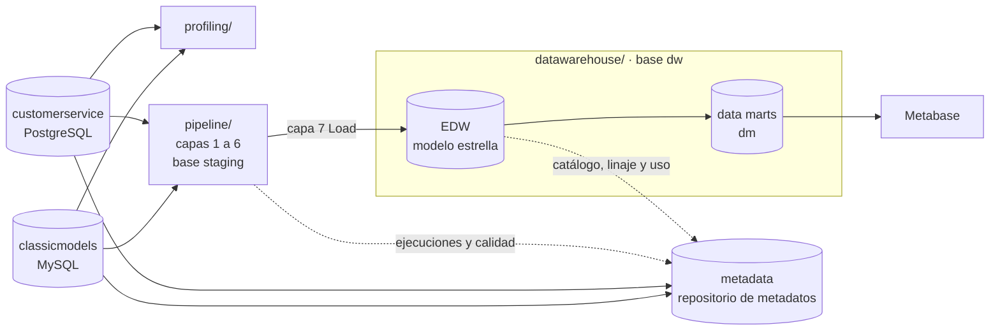

# Proyecto Final — Modelos y Persistencia de Datos

**Pontificia Universidad Javeriana — Modelos y Persistencia de Datos — 2026-03**

Elaborado por: Luis Daniel Sierra Pineda, David Cortes, Salomón Saenz

Este repositorio integra dos fuentes de datos de una misma organización y construye sobre ellas:

1. **Descubrimiento y perfilamiento** de las dos fuentes (Entrega 1).
2. Un **repositorio de metadatos** con metadatos técnicos, de negocio, de linaje, de procesos, de calidad y de uso (Entregas 1 y 2).
3. Un **almacén de datos dimensional**, cargado por un ETL por capas (Entrega 2).
4. **Reportes** en Metabase que leen solo el almacén (Entrega 2).

Los enunciados oficiales están en [`docs/enunciados/`](docs/enunciados/).

## Fuentes

| Fuente | Motor | Contenido | Dump |
|---|---|---|---|
| `classicmodels` | MySQL 8 | Ventas: clientes, empleados, oficinas, órdenes, detalle de órdenes, pagos, productos y líneas de producto (8 tablas) | [`sources/mysqlsampledatabase.sql`](sources/mysqlsampledatabase.sql) |
| `customerservice` | PostgreSQL 16 | Centro de atención: llamadas, clientes, empleados, productos y productos de interés por cliente (5 tablas) | [`sources/customerservice.sql`](sources/customerservice.sql) |

Los dos dumps son los originales del curso y no se modifican.

## Arranque rápido

Solo hace falta **Docker** y **Python 3.9 o superior**.

```bash
python run_all.py
```

El script levanta el stack de [`docker-compose.yml`](docker-compose.yml), restaura las dos fuentes desde `sources/`, crea `.env` a partir de [`.env.example`](.env.example), instala las dependencias de [`requirements.txt`](requirements.txt) y ejecuta los 34 pasos del pipeline. La primera vez tarda algunos minutos mientras descarga las imágenes de Docker.

| Opción | Qué hace |
|---|---|
| `python run_all.py` | Levanta el stack y ejecuta el pipeline completo |
| `python run_all.py --etl-only` | No toca Docker; ejecuta el pipeline contra las bases del `.env` |
| `python run_all.py --etl-only --from-step N` | Retoma en el paso N sin repetir los anteriores; si un paso falla, el mensaje de error indica este comando con su número. Si el paso N es un proceso del pipeline, su corrida fallida continúa desde la capa donde se detuvo |
| `python run_all.py --reset` | Borra los volúmenes de Docker y reconstruye todo desde cero |
| `python run_all.py --down` | Apaga el stack conservando los datos |

Al terminar:

| Servicio | Dirección | Usuario / clave |
|---|---|---|
| Metabase (reportes) | http://localhost:3000 | `grupo@javeriana.edu.co` / `Javeriana2026!` |
| Almacén de datos | `localhost:5434`, base `dw` | `postgres` / `javeriana` |
| Staging del pipeline | `localhost:5434`, base `staging` | `postgres` / `javeriana` |
| Repositorio de metadatos | `localhost:5434`, base `metadata` | `postgres` / `javeriana` |
| classicmodels | `localhost:3307` | `root` / `javeriana` |
| customerservice | `localhost:5433`, base `customerservice` | `postgres` / `javeriana` |

El almacén, el staging del pipeline y el repositorio de metadatos son tres bases separadas dentro de la misma instancia de PostgreSQL. [`tools/check_connections.py`](tools/check_connections.py) verifica que las cinco cadenas del `.env` respondan.

## Qué hace el pipeline

`run_all.py` ejecuta estos pasos en orden y se detiene en el primero que falle:

| # | Grupo | Pasos |
|---|---|---|
| 1–4 | Perfilamiento de las fuentes | Metadatos técnicos y perfil por columna desde los dumps, reporte de columnas y llaves, integridad referencial y correspondencia entre fuentes, descubrimiento de relaciones no declaradas |
| 5–11 | Repositorio de metadatos | Esquema base y de staging, ETL de metadatos técnicos, glosario de negocio y linaje semántico, extensión del almacén, reglas de calidad, extensión de uso |
| 12–14 | Almacén de datos | Tablas del EDW, sus miembros especiales (Desconocido, Sin asignar) y vistas de los data marts en la base `dw` |
| 15–19 | Pipeline | Base `staging` y sus tablas; procesos de staging (capas 1–4), dimensiones y hechos (capas 5–7) |
| 20–21 | Metadatos del almacén | Catálogo del almacén con su linaje y medición de uso |
| 22–27 | Pruebas | Conciliación del almacén con las fuentes (cargado + rechazado), camino de rechazo de la capa de calidad (cascada, duplicados y órdenes incompletas), verificación de forma de la capa 6, Load todo-o-nada ante una falla forzada, retoma entre procesos y retoma de una corrida desde la capa que falló |
| 28 | Retención | Depura las corridas viejas del staging y conserva las últimas 3 por proceso y las que alimentan el almacén |
| 29 | Reportes | Dashboard de Metabase |
| 30–32 | Backups | Backup del almacén y del repositorio, y prueba de restauración de ambos |
| 33 | Calidad por etapa | [`docs/data_quality_report.md`](docs/data_quality_report.md): registros que entran y salen de cada capa, nulos resueltos y conservados, y sobre qué porcentaje de los datos se apoya cada análisis |
| 34 | Diagramas | Diagramas físicos y del pipeline en [`docs/img/`](docs/img/) |

Antes de sacar conclusiones de los dashboards, lea el [reporte de calidad por etapa](docs/data_quality_report.md): dice qué parte de los datos es verificable y qué decisiones recortan la base de cada análisis.

Todos los pasos se pueden volver a ejecutar sobre bases ya cargadas: los DDL del repositorio y del staging usan `IF NOT EXISTS`, las cargas usan *upsert* o reemplazan el contenido, y las tablas de staging solo agregan filas nuevas bajo un `run_id`, así que el historial de corridas sobrevive a cada `run_all.py` (la retención del paso 28 conserva las corridas recientes y las que alimentan el almacén). La excepción es el DDL del almacén (paso 12), que lo recrea vacío para que el pipeline lo vuelva a cargar. Cómo se retoma una carga que falla a mitad de camino, desde la capa donde se detuvo, está en el [README del pipeline](pipeline/README.md#tolerancia-a-fallos).



## Estructura del repositorio

```
├── run_all.py                  Orquestador del proyecto completo
├── docker-compose.yml          MySQL, PostgreSQL (fuente), PostgreSQL (metadata + staging + dw) y Metabase
├── docker/init-dw.sql          Crea las bases 'dw' y 'staging' junto a 'metadata'
├── .env.example                Cadenas de conexión del stack local
├── requirements.txt            Dependencias de Python del pipeline
├── sources/                    Dumps originales de las dos fuentes
├── profiling/                  Descubrimiento y perfilamiento de las fuentes      → profiling/README.md
├── metadata_repository/        Repositorio de metadatos: DDL, seeds, ETL, consultas, backup
│                                                                                  → metadata_repository/README.md
├── pipeline/                   Pipeline ETL: las 7 capas de Giordano, base staging → pipeline/README.md
├── datawarehouse/              Almacén de datos, base dw                         → datawarehouse/README.md
│   ├── edw/                    Almacén empresarial (modelo estrella), schema public
│   └── data_marts/             Data marts, schema dm
├── reports/                    Dashboard de Metabase                              → reports/README.md
├── tools/                      Utilidades compartidas (ver abajo)
└── docs/
    ├── data_quality_report.md  Calidad de datos por etapa (generado)
    ├── enunciados/             Enunciados oficiales de las entregas
    └── img/                    Diagramas generados desde las bases (.dot y .png)
```

| Utilidad | Uso |
|---|---|
| [`tools/run_sql.py`](tools/run_sql.py) | Ejecuta un archivo `.sql` contra la base indicada por una variable del `.env` (por defecto `DW_URL`) |
| [`tools/check_connections.py`](tools/check_connections.py) | Verifica las cinco conexiones del `.env` |
| [`tools/create_database.py`](tools/create_database.py) | Crea la base de una cadena del `.env` si no existe; `run_all.py` la usa para `staging` en volúmenes creados antes de esa base |
| [`tools/generate_backup.py`](tools/generate_backup.py) | Genera el backup SQL del almacén (`dw`) o del repositorio (`metadata`) |
| [`tools/generate_quality_report.py`](tools/generate_quality_report.py) | Genera [`docs/data_quality_report.md`](docs/data_quality_report.md) a partir de lo que cada capa del pipeline dejó en la base `staging`, del almacén y del linaje del repositorio |
| [`tools/generate_diagrams.py`](tools/generate_diagrams.py) | Genera los diagramas de `docs/img/` introspeccionando las bases; renderiza con Graphviz local o con la imagen Docker `nshine/dot` |

## Convención de idioma

- **En español**: todo lo que vive en las bases de datos o se deriva de las fuentes — nombres de tablas y columnas del almacén y del repositorio (`fact_ventas`, `dim_cliente`, `usage_consulta`), valores guardados (reglas de calidad, descripciones, linaje), archivos de salida del perfilamiento, títulos de reportes y diagramas, y esta documentación.
- **En inglés**: el código — nombres de archivos, funciones, variables, comentarios, docstrings y mensajes de consola.

## Correspondencia con los enunciados

| Entrega | Requisito | Dónde está |
|---|---|---|
| 1 | Descubrimiento: metadatos técnicos, estructuras comunes y diferencias | [`profiling/`](profiling/README.md), `profiling/output/metadata_tecnico.csv`, `columnas_por_tabla.md`, `comparacion_entidades_comunes.csv` |
| 1 | Perfilamiento: rangos, patrones de texto, % de nulos, correspondencia y duplicados | `profiling/output/perfilamiento.csv`, `correspondencia_entidades.csv`, `relaciones_fk.csv`, `relaciones_inferidas.csv`, `profiling/reports/` |
| 1 | Repositorio de metadatos con metadatos técnicos cargados por ETL | [`metadata_repository/`](metadata_repository/README.md): `ddl/01_core_schema.sql`, `etl/etl_source_metadata.py` |
| 1 | Metadatos de negocio y linaje semántico | `metadata_repository/seeds/business_metadata.sql` |
| 1 | Las seis consultas | `metadata_repository/queries/required_questions.sql` |
| 1 | Diagrama físico del repositorio | `docs/img/metadata_core_erd.png` |
| 2 | Hecho diseñado y diseño físico del almacén | [`datawarehouse/edw/`](datawarehouse/edw/README.md): `star_schema.sql`, `docs/img/dw_star_schema.png` |
| 2 | Construcción del almacén y la base dimensional | [`datawarehouse/edw/`](datawarehouse/edw/README.md) y [`datawarehouse/data_marts/`](datawarehouse/data_marts/README.md) |
| 2 | Metadatos del almacén y diagrama físico del repositorio completo | `metadata_repository/ddl/03_dw_extension.sql`, `04_usage_extension.sql`, `docs/img/metadata_repository_erd.png` |
| 2 | Procesos ETL y problemas de calidad resueltos | [`pipeline/`](pipeline/README.md), `metadata_repository/seeds/dq_rules.sql`, `docs/img/etl_pipeline.png`, [`docs/data_quality_report.md`](docs/data_quality_report.md) |
| 2 | Reportes conectados al almacén | [`reports/`](reports/README.md) |
| 1 y 2 | Backups | `metadata_repository/backup/metadata_repo_backup.sql`, `datawarehouse/edw/backup/dw_backup.sql` |

## Herramientas

| Componente | Herramienta |
|---|---|
| Fuentes | MySQL 8.0 y PostgreSQL 16 en Docker |
| Repositorio de metadatos, staging del pipeline y almacén | PostgreSQL 16 en Docker |
| Pipeline, perfilamiento, pruebas y backups | Python 3.11, SQLAlchemy 2, pandas |
| Reportes HTML de perfilamiento | ydata-profiling |
| Reportes | Metabase (open source) en Docker |
| Diagramas | Graphviz |
