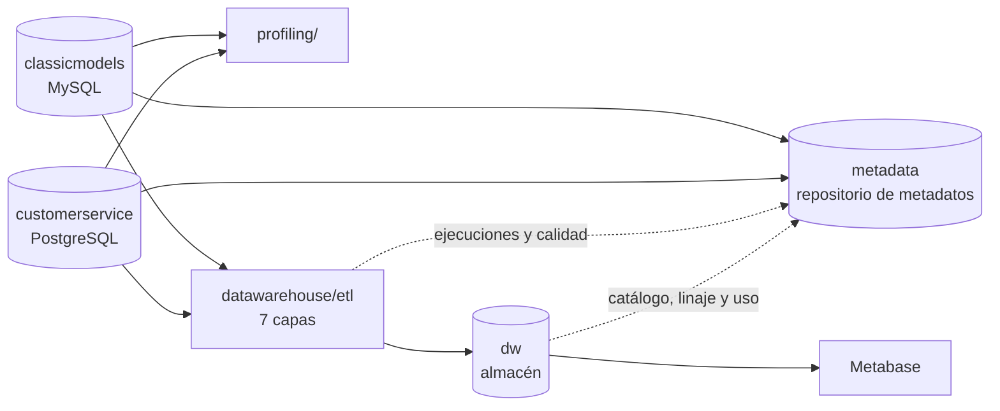

# Proyecto Final — Modelos y Persistencia de Datos

**Pontificia Universidad Javeriana — Modelos y Persistencia de Datos — 2026-03**

Elaborado por: Luis Daniel Sierra Pineda, David Cortes, Salomón Saenz

Este repositorio integra dos fuentes de datos de una misma organización y construye sobre ellas:

1. **Descubrimiento y perfilamiento** de las dos fuentes (Entrega 1).
2. Un **repositorio de metadatos** con metadatos técnicos, de negocio, de linaje, de procesos, de calidad y de uso (Entregas 1 y 2).
3. Un **almacén de datos dimensional**, cargado por un ETL por capas (Entrega 2).
4. **Reportes** en Metabase que leen solo el almacén (Entrega 2).

Los enunciados oficiales están en [`docs/enunciados/`](docs/enunciados/).

## Fuentes

| Fuente | Motor | Contenido | Dump |
|---|---|---|---|
| `classicmodels` | MySQL 8 | Ventas: clientes, empleados, oficinas, órdenes, detalle de órdenes, pagos, productos y líneas de producto (8 tablas) | [`sources/mysqlsampledatabase.sql`](sources/mysqlsampledatabase.sql) |
| `customerservice` | PostgreSQL 16 | Centro de atención: llamadas, clientes, empleados, productos y productos de interés por cliente (5 tablas) | [`sources/customerservice.sql`](sources/customerservice.sql) |

Los dos dumps son los originales del curso y no se modifican.

## Arranque rápido

Solo hace falta **Docker** y **Python 3.9 o superior**.

```bash
python run_all.py
```

El script levanta el stack de [`docker-compose.yml`](docker-compose.yml), restaura las dos fuentes desde `sources/`, crea `.env` a partir de [`.env.example`](.env.example), instala las dependencias de [`requirements.txt`](requirements.txt) y ejecuta los 26 pasos del pipeline. La primera vez tarda algunos minutos mientras descarga las imágenes de Docker.

| Opción | Qué hace |
|---|---|
| `python run_all.py` | Levanta el stack y ejecuta el pipeline completo |
| `python run_all.py --etl-only` | No toca Docker; ejecuta el pipeline contra las bases del `.env` |
| `python run_all.py --reset` | Borra los volúmenes de Docker y reconstruye todo desde cero |
| `python run_all.py --down` | Apaga el stack conservando los datos |

Al terminar:

| Servicio | Dirección | Usuario / clave |
|---|---|---|
| Metabase (reportes) | http://localhost:3000 | `grupo@javeriana.edu.co` / `Javeriana2026!` |
| Almacén de datos | `localhost:5434`, base `dw` | `postgres` / `javeriana` |
| Repositorio de metadatos | `localhost:5434`, base `metadata` | `postgres` / `javeriana` |
| classicmodels | `localhost:3307` | `root` / `javeriana` |
| customerservice | `localhost:5433`, base `customerservice` | `postgres` / `javeriana` |

El almacén y el repositorio de metadatos son dos bases separadas dentro de la misma instancia de PostgreSQL. [`tools/check_connections.py`](tools/check_connections.py) verifica que las cuatro cadenas del `.env` respondan.

## Qué hace el pipeline

`run_all.py` ejecuta estos pasos en orden y se detiene en el primero que falle:

| # | Grupo | Pasos |
|---|---|---|
| 1–4 | Perfilamiento de las fuentes | Metadatos técnicos y perfil por columna desde los dumps, reporte de columnas y llaves, integridad referencial y correspondencia entre fuentes, descubrimiento de relaciones no declaradas |
| 5–11 | Repositorio de metadatos | Esquema base y de staging, ETL de metadatos técnicos, glosario de negocio y linaje semántico, extensión del almacén, reglas de calidad, extensión de uso |
| 12–17 | Almacén de datos | Modelo estrella, capas de staging y data marts; ETL de staging (capas 1–4), de dimensiones y de hechos (capas 5–7) |
| 18–19 | Metadatos del almacén | Catálogo del almacén con su linaje y medición de uso |
| 20–21 | Pruebas | Totales del almacén contra las fuentes y camino de rechazo de la capa de calidad |
| 22 | Reportes | Dashboard de Metabase |
| 23–25 | Backups | Backup del almacén y del repositorio, y prueba de restauración de ambos |
| 26 | Diagramas | Diagramas físicos y del pipeline en [`docs/img/`](docs/img/) |

Todos los pasos se pueden volver a ejecutar sobre bases ya cargadas: los DDL del repositorio usan `IF NOT EXISTS`, las cargas usan *upsert* o reemplazan el contenido, y las tablas de staging solo agregan filas nuevas bajo un `run_id`.



## Estructura del repositorio

```
├── run_all.py                  Orquestador del proyecto completo
├── docker-compose.yml          MySQL, PostgreSQL (fuente), PostgreSQL (metadata + dw) y Metabase
├── docker/init-dw.sql          Crea la base 'dw' junto a 'metadata'
├── .env.example                Cadenas de conexión del stack local
├── requirements.txt            Dependencias de Python del pipeline
├── sources/                    Dumps originales de las dos fuentes
├── profiling/                  Descubrimiento y perfilamiento de las fuentes      → profiling/README.md
├── metadata_repository/        Repositorio de metadatos: DDL, seeds, ETL, consultas, backup
│                                                                                  → metadata_repository/README.md
├── datawarehouse/              Almacén: DDL, ETL, consultas, pruebas, backup      → datawarehouse/README.md
├── reports/                    Dashboard de Metabase                              → reports/README.md
├── tools/                      Utilidades compartidas (ver abajo)
└── docs/
    ├── enunciados/             Enunciados oficiales de las entregas
    └── img/                    Diagramas generados desde las bases (.dot y .png)
```

| Utilidad | Uso |
|---|---|
| [`tools/run_sql.py`](tools/run_sql.py) | Ejecuta un archivo `.sql` contra la base indicada por una variable del `.env` (por defecto `DW_URL`) |
| [`tools/check_connections.py`](tools/check_connections.py) | Verifica las cuatro conexiones del `.env` |
| [`tools/generate_backup.py`](tools/generate_backup.py) | Genera el backup SQL del almacén (`dw`) o del repositorio (`metadata`) |
| [`tools/generate_diagrams.py`](tools/generate_diagrams.py) | Genera los diagramas de `docs/img/` introspeccionando las bases; renderiza con Graphviz local o con la imagen Docker `nshine/dot` |

## Convención de idioma

- **En español**: todo lo que vive en las bases de datos o se deriva de las fuentes — nombres de tablas y columnas del almacén y del repositorio (`fact_ventas`, `dim_cliente`, `usage_consulta`), valores guardados (reglas de calidad, descripciones, linaje), archivos de salida del perfilamiento, títulos de reportes y diagramas, y esta documentación.
- **En inglés**: el código — nombres de archivos, funciones, variables, comentarios, docstrings y mensajes de consola.

## Correspondencia con los enunciados

| Entrega | Requisito | Dónde está |
|---|---|---|
| 1 | Descubrimiento: metadatos técnicos, estructuras comunes y diferencias | [`profiling/`](profiling/README.md), `profiling/output/metadata_tecnico.csv`, `columnas_por_tabla.md`, `comparacion_entidades_comunes.csv` |
| 1 | Perfilamiento: rangos, patrones de texto, % de nulos, correspondencia y duplicados | `profiling/output/perfilamiento.csv`, `correspondencia_entidades.csv`, `relaciones_fk.csv`, `relaciones_inferidas.csv`, `profiling/reports/` |
| 1 | Repositorio de metadatos con metadatos técnicos cargados por ETL | [`metadata_repository/`](metadata_repository/README.md): `ddl/01_core_schema.sql`, `etl/etl_source_metadata.py` |
| 1 | Metadatos de negocio y linaje semántico | `metadata_repository/seeds/business_metadata.sql` |
| 1 | Las seis consultas | `metadata_repository/queries/required_questions.sql` |
| 1 | Diagrama físico del repositorio | `docs/img/metadata_core_erd.png` |
| 2 | Hecho diseñado y diseño físico del almacén | [`datawarehouse/`](datawarehouse/README.md): `ddl/01_star_schema.sql`, `docs/img/dw_star_schema.png` |
| 2 | Construcción del almacén y la base dimensional | `datawarehouse/ddl/`, data marts en `ddl/03_data_marts.sql` |
| 2 | Metadatos del almacén y diagrama físico del repositorio completo | `metadata_repository/ddl/03_dw_extension.sql`, `04_usage_extension.sql`, `docs/img/metadata_repository_erd.png` |
| 2 | Procesos ETL y problemas de calidad resueltos | `datawarehouse/etl/`, `metadata_repository/seeds/dq_rules.sql`, `docs/img/etl_pipeline.png` |
| 2 | Reportes conectados al almacén | [`reports/`](reports/README.md) |
| 1 y 2 | Backups | `metadata_repository/backup/metadata_repo_backup.sql`, `datawarehouse/backup/dw_backup.sql` |

## Herramientas

| Componente | Herramienta |
|---|---|
| Fuentes | MySQL 8.0 y PostgreSQL 16 en Docker |
| Repositorio de metadatos y almacén | PostgreSQL 16 en Docker |
| ETL, perfilamiento, pruebas y backups | Python 3.11, SQLAlchemy 2, pandas |
| Reportes HTML de perfilamiento | ydata-profiling |
| Reportes | Metabase (open source) en Docker |
| Diagramas | Graphviz |

### Por qué Docker y no Railway

El enunciado de la Entrega 1 recomendaba Railway como servicio en la nube, y ahí se hospedó el proyecto durante esa entrega. Para la Entrega 2 se migró a un stack 100% local con `docker-compose`. La razón de fondo no es solo el costo (Railway cobra 5 USD/mes y el proyecto ya necesita cuatro servicios corriendo a la vez), sino que **el proyecto ahora depende de poder reconstruir el stack completo de forma determinista**: `run_all.py --reset` borra los volúmenes y recarga todo desde cero, y sobre esa garantía se apoyan directamente `datawarehouse/tests/test_backup_restore.py`, `test_dq_reject_path.py` y `check_freshness.py`. Esos tests solo son confiables si corren contra un estado que nadie más pudo haber alterado mientras tanto; una base compartida en la nube, con dos o tres personas del equipo corriendo el ETL al mismo tiempo, no ofrece esa garantía sin coordinación manual.

Docker resuelve esto por diseño: cada persona —incluido quien evalúe el proyecto— obtiene un entorno aislado y desechable, sin necesitar cuenta, credenciales ni esperar a que un servicio en la nube responda. Como beneficio adicional, fijar la versión exacta del motor (`postgres:16-alpine`, `mysql:8.0`) elimina de raíz el tipo de problema que el proyecto sí sufrió con Railway: su Postgres 18 no era compatible con la versión de `pg_dump` disponible en las máquinas del equipo, lo que obligó a escribir un generador de backups propio (`tools/generate_backup.py`) en primer lugar.
