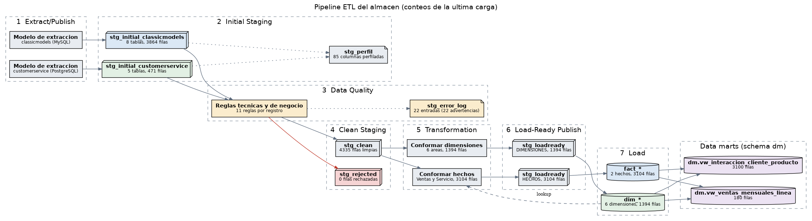

# Almacén de datos

Base PostgreSQL `dw` con un modelo dimensional en constelación: dos hechos que comparten dimensiones conformadas. Se carga con un ETL de siete capas que lee cada fuente una sola vez y deja cada capa persistida en el schema `staging_dw`.

## Modelo dimensional


La pregunta de negocio que guía el diseño es **qué productos generan más llamadas de servicio por unidad vendida**. Las ventas están en `classicmodels` y las llamadas en `customerservice`; como clientes y productos comparten la misma llave en ambas fuentes, los dos hechos se pueden cruzar a través de dimensiones conformadas.

### Hechos

**`fact_ventas`** — grano: una línea de una orden de compra (2.996 filas). Se alimenta de `orderdetails`, `orders`, `products`, `customers` y `employees`.

| Medida | Cálculo | Aditividad |
|---|---|---|
| `cantidad_ordenada` | `quantityOrdered` | Aditiva |
| `precio_unitario` | `priceEach` | No aditiva |
| `monto_linea` | `quantityOrdered * priceEach` | Aditiva |
| `costo_linea` | `quantityOrdered * buyPrice` | Aditiva |
| `margen_linea` | `monto_linea - costo_linea` | Aditiva |
| `precio_msrp` | `MSRP` | No aditiva |
| `dias_hasta_envio` | `shippedDate - orderDate`; nulo si la orden no se despachó | Semi-aditiva |

Dimensiones degeneradas: `numero_orden`, `numero_linea`.

**`fact_llamadas_servicio`** — grano: una llamada (108 filas). Se alimenta de `cs_customer_calls`.

| Medida | Cálculo | Aditividad |
|---|---|---|
| `cantidad_llamadas` | Constante 1 | Aditiva |
| `longitud_texto` | `length(text)` | Aditiva |

Dimensión degenerada: `texto_llamada`.

### Dimensiones

| Dimensión | Filas | Conformada | Origen |
|---|---|---|---|
| `dim_tiempo` | 1.096 | Sí | Generada: un día entre 2003-01-01 y 2005-12-31; llave `AAAAMMDD` |
| `dim_cliente` | 122 | Sí | `customers`; `cs_customers` aporta la bandera `presente_en_servicio`. `direccion_completa` une `addressLine1` y `addressLine2` |
| `dim_producto` | 110 | Sí | `products` con `productlines` desnormalizada; `cs_products` aporta `presente_en_servicio` |
| `dim_empleado` | 53 | No | Unión de `employees` (23 vendedores) y `cs_employees` (30 agentes) con llave de negocio compuesta `(numero_empleado, sistema_origen)` |
| `dim_oficina` | 7 | No | `offices` |
| `dim_estado_orden` | 6 | No | Valores distintos de `orders.status`; `es_efectiva` es falso para Cancelled, Disputed y On Hold |

Cada dimensión tiene llave subrogada (`*_key`) y llave de negocio. Todas son de tipo 1: se recargan completas en cada corrida porque las fuentes son snapshots sin historial.

### Data marts (schema `dm`)

| Vista | Grano | Contenido |
|---|---|---|
| `dm.vw_interaccion_cliente_producto` | Cliente × producto × mes | Unidades, monto, margen y líneas vendidas junto a las llamadas recibidas (`FULL OUTER JOIN` de los dos hechos) y `llamadas_por_unidad` |
| `dm.vw_ventas_mensuales_linea` | Mes × línea de producto | Órdenes, unidades, monto, margen y % de margen de las órdenes efectivas |

## ETL



El ETL sigue la arquitectura de referencia de integración de datos de Giordano. Cada capa es una tabla física en `staging_dw`; las tablas de staging nunca se truncan y cada corrida queda identificada por su `run_id` en `staging_dw.etl_run`.

| # | Capa | Tabla(s) | Proceso |
|---|---|---|---|
| 1 | Extract/Publish | Modelos de extracción en `EXTRACTION_MODELS` | `etl_dw_staging.py` |
| 2 | Initial Staging | `stg_initial_classicmodels`, `stg_initial_customerservice` (fila original en JSONB), `stg_perfil` (perfil por columna) | `etl_dw_staging.py` |
| 3 | Data Quality | `stg_error_log` (una fila por regla incumplida) | `etl_dw_staging.py` |
| 4 | Clean Staging | `stg_clean`, `stg_rejected` | `etl_dw_staging.py` |
| 5 | Transformation | `stg_transform` (área conformada y operaciones aplicadas) | `etl_dw_dimensions.py`, `etl_dw_facts.py` |
| 6 | Load-Ready Publish | `stg_loadready` (`DIMENSIONES` o `HECHOS`) | `etl_dw_dimensions.py`, `etl_dw_facts.py` |
| 7 | Load | `dim_*`, `fact_*` | `etl_dw_dimensions.py`, `etl_dw_facts.py` |

Los tres procesos se ejecutan en orden:

1. **`etl_dw_staging.py`** lee las 13 tablas de las fuentes una sola vez, incluidas `payments` y `cs_customer_products`, que el modelo actual no usa. Perfila lo que aterrizó, evalúa las 11 reglas de calidad de la capa `DATA_QUALITY` y separa los registros: los que incumplen una regla bloqueante van a `stg_rejected` y el resto a `stg_clean`.
2. **`etl_dw_dimensions.py`** lee `stg_clean` de la última corrida de staging exitosa (no las fuentes), conforma cada área temática y recarga las seis dimensiones.
3. **`etl_dw_facts.py`** lee la misma corrida de staging, hace los joins, resuelve las llaves subrogadas contra las dimensiones ya cargadas, calcula las medidas y recarga los dos hechos. Si alguna llave obligatoria queda sin resolver, detiene la carga en vez de escribir un hecho huérfano.

`common.py` reúne las conexiones, el control de corridas, la lectura y escritura de capas y el registro de cada corrida en el repositorio de metadatos (`etl_process`, `etl_execution`, `dq_result`).

La vista `staging_dw.vw_trazabilidad_capas` muestra cuántas filas pasó cada corrida por cada capa y `staging_dw.vw_reporte_transacciones_malas` lista el contenido de `stg_error_log`.

### Reglas de calidad de la capa 3

| Regla | Clase | Acción |
|---|---|---|
| `campos_obligatorios` (columnas `NOT NULL` según `db_column` del repositorio de metadatos) | Técnica | Rechazo |
| `tipo_de_dato_valido` (fechas y números interpretables) | Técnica | Rechazo |
| `formato_email` | Técnica | Advertencia |
| `integridad_referencial` (dentro de cada fuente y de las llamadas contra `classicmodels`) | Negocio | Rechazo |
| `valores_positivos` | Negocio | Rechazo |
| `secuencia_de_fechas` | Negocio | Rechazo |
| `envio_consistente_con_estado` | Negocio | Rechazo |
| `precio_sugerido_coherente` | Negocio | Advertencia |
| `cliente_con_vendedor` | Negocio | Advertencia |
| `consistencia_entre_fuentes_cliente` / `_producto` | Negocio | Advertencia |

Con los datos originales, los 4.335 registros quedan en `stg_clean` y `stg_error_log` tiene 22 advertencias de `cliente_con_vendedor`.

### Hallazgos del perfilamiento resueltos en la transformación

| Hallazgo | Tratamiento | Regla registrada |
|---|---|---|
| `productlines.htmlDescription` e `image` 100 % vacías | No pasan a `dim_producto` | `productline_columnas_vacias` |
| `customers.addressLine2` nula en 100 de 122 filas | Se une con `addressLine1` en `direccion_completa` | `cliente_direccion_linea2_nula` |
| `orders.comments` nula en 246 de 326 órdenes | No pasa al almacén | `orden_comentarios_nulos` |
| `shippedDate` nula en 141 líneas de órdenes no despachadas | `dias_hasta_envio` queda nulo | `orden_fecha_envio_nula` |
| Empleados sin llave común entre fuentes | Llave compuesta en `dim_empleado` | `empleado_conformidad_fuentes` |
| Clientes y productos presentes en ambas fuentes | Dimensiones conformadas | `cliente_conformidad_fuentes`, `producto_conformidad_fuentes` |
| Órdenes canceladas, en disputa o en espera | Se cargan; `es_efectiva` permite excluirlas | `estado_orden_no_efectivo` |

## Archivos

| Archivo | Contenido |
|---|---|
| [`ddl/01_star_schema.sql`](ddl/01_star_schema.sql) | Dimensiones, hechos e índices sobre las llaves foráneas |
| [`ddl/02_staging_layers.sql`](ddl/02_staging_layers.sql) | Schema `staging_dw`: control de corridas, tablas de cada capa y vistas de monitoreo |
| [`ddl/03_data_marts.sql`](ddl/03_data_marts.sql) | Schema `dm` con las dos vistas de data mart |
| [`etl/common.py`](etl/common.py) | Utilidades compartidas por los tres procesos |
| [`etl/etl_dw_staging.py`](etl/etl_dw_staging.py) | Capas 1 a 4 |
| [`etl/etl_dw_dimensions.py`](etl/etl_dw_dimensions.py) | Capas 5 a 7 de las dimensiones |
| [`etl/etl_dw_facts.py`](etl/etl_dw_facts.py) | Capas 5 a 7 de los hechos |
| [`queries/business_questions.sql`](queries/business_questions.sql) | Consultas de negocio sobre el almacén, equivalentes a las del dashboard |
| [`tests/validate_against_sources.py`](tests/validate_against_sources.py) | Compara 9 totales del almacén contra las fuentes (monto, unidades, líneas, órdenes, llamadas, clientes, productos, oficinas, empleados) |
| [`tests/test_dq_reject_path.py`](tests/test_dq_reject_path.py) | Arma un lote sintético con un defecto por regla y verifica que los bloqueantes se rechacen, que las advertencias pasen y que ningún registro sano se marque |
| [`tests/test_backup_restore.py`](tests/test_backup_restore.py) | Restaura los dos backups en una base temporal y compara conteos de tablas y vistas |
| [`backup/dw_backup.sql`](backup/dw_backup.sql) | Backup del modelo dimensional y los data marts con todos los datos |

## Backup

`backup/dw_backup.sql` lo genera `python tools/generate_backup.py dw`: el DDL de `ddl/01_star_schema.sql` y `ddl/03_data_marts.sql` seguido de los datos de las ocho tablas. No incluye `staging_dw`, que se reconstruye al ejecutar el ETL. Se restaura sobre una base vacía con:

```bash
psql "<url-de-la-base>" -f datawarehouse/backup/dw_backup.sql
```
