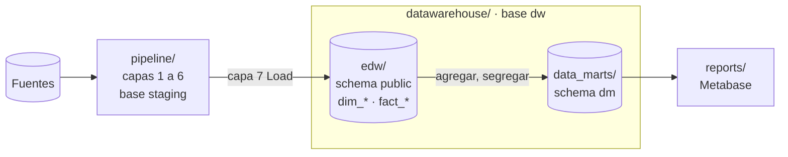

# Almacén de datos

La base PostgreSQL `dw` contiene solo el almacén: lo que en clase va *dentro* del DW (Clase 4-5, "Flujo de datos dentro de DW": ODS → EDW → DM). El proceso que lo carga es el [pipeline](../pipeline/README.md), que vive en otra carpeta y trabaja en otra base (`staging`), tal como en el "Mapa general de BI" el ETL está entre las fuentes y el DW, fuera de él.



| Componente | Carpeta | Esquema | Qué es |
|---|---|---|---|
| ODS | — | — | No se implementa: las fuentes son copias estáticas y ningún proceso operativo necesita consultar datos integrados en tiempo real |
| EDW | [`edw/`](edw/README.md) | `public` | El modelo dimensional en constelación: 6 dimensiones y 2 hechos. Es la fuente única para el análisis |
| Data marts | [`data_marts/`](data_marts/README.md) | `dm` | Vistas por tema construidas sobre el EDW, con el grano que usa cada análisis |

El almacén no transforma nada: recibe lo que el pipeline deja listo en su capa 6 (Load-Ready Publish), y la capa 7 (Load) es lo único del pipeline que escribe en `dw`.

```
datawarehouse/
├── edw/                         EDW → schema public
│   ├── star_schema.sql            Dimensiones, hechos e índices
│   ├── special_members.sql        Miembros especiales: -1 Desconocido, -2 Sin asignar
│   ├── business_questions.sql     Consultas de negocio sobre el EDW
│   └── backup/dw_backup.sql       Backup del EDW y los data marts con todos los datos
├── data_marts/                  Data marts → schema dm
│   └── data_marts.sql             Las dos vistas de data mart
└── tests/
    ├── validate_against_sources.py  Compara 9 totales del EDW contra las fuentes
    └── test_backup_restore.py       Restaura los backups en una base temporal y compara conteos
```

| Prueba | Qué comprueba |
|---|---|
| [`tests/validate_against_sources.py`](tests/validate_against_sources.py) | El EDW cuadra con las fuentes: monto, unidades, líneas, órdenes, llamadas, clientes, productos, oficinas y empleados |
| [`tests/test_backup_restore.py`](tests/test_backup_restore.py) | El backup del EDW y el del repositorio de metadatos se restauran en una base temporal con los mismos conteos de tablas y vistas |

Las pruebas del pipeline (camino de rechazo de la calidad y Load todo-o-nada) están en [`pipeline/tests/`](../pipeline/tests/).
