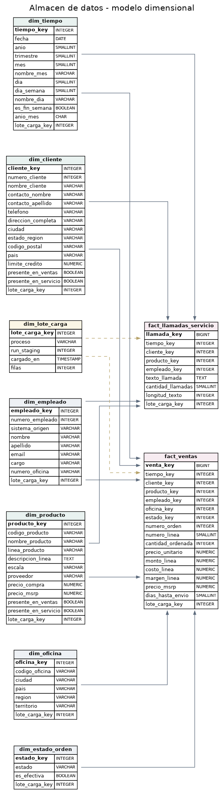

# Almacén empresarial (EDW)

El almacén propiamente dicho: un modelo dimensional en constelación, con dos hechos que comparten dimensiones conformadas, en el schema `public` de la base `dw`. Lo carga la capa 7 del [pipeline](../../pipeline/README.md), que trabaja en su propia base (`staging`), y sobre él se construyen los [data marts](../data_marts/README.md) y el dashboard.



La pregunta de negocio que guía el diseño es **qué productos generan más llamadas de servicio por unidad vendida**. Las ventas están en `classicmodels` y las llamadas en `customerservice`. Como clientes y productos tienen la misma llave en ambas fuentes, los dos hechos se pueden cruzar a través de dimensiones conformadas.

## Hechos

**`fact_ventas`**. Grano: una línea de una orden de compra (2.996 filas). Se alimenta de `orderdetails`, `orders`, `products`, `customers` y `employees`.

| Medida | Cálculo | Aditividad |
|---|---|---|
| `cantidad_ordenada` | `quantityOrdered` | Aditiva |
| `precio_unitario` | `priceEach` | No aditiva |
| `monto_linea` | `quantityOrdered * priceEach` | Aditiva |
| `costo_linea` | `quantityOrdered * buyPrice` | Aditiva |
| `margen_linea` | `monto_linea - costo_linea` | Aditiva |
| `precio_msrp` | `MSRP` | No aditiva |
| `dias_hasta_envio` | `shippedDate - orderDate`; nulo si la orden no se despachó | Semi-aditiva |

Dimensiones degeneradas: `numero_orden`, `numero_linea`.

**`fact_llamadas_servicio`**. Grano: una llamada (108 filas). Se alimenta de `cs_customer_calls`.

| Medida | Cálculo | Aditividad |
|---|---|---|
| `cantidad_llamadas` | Constante 1 | Aditiva |
| `longitud_texto` | `length(text)` | Aditiva |

Dimensión degenerada: `texto_llamada`.

## Dimensiones

| Dimensión | Filas | Conformada | Origen |
|---|---|---|---|
| `dim_tiempo` | 1.096 | Sí | Generada: todos los días de los años que cubren las ventas y las llamadas (hoy, 2003-01-01 a 2005-12-31); llave `AAAAMMDD` |
| `dim_cliente` | 122 | Sí | `customers`; `cs_customers` aporta la bandera `presente_en_servicio`. `direccion_completa` une `addressLine1` y `addressLine2` |
| `dim_producto` | 110 | Sí | `products` con `productlines` desnormalizada; `cs_products` aporta `presente_en_servicio` |
| `dim_empleado` | 53 | No | Unión de `employees` (23 vendedores) y `cs_employees` (30 agentes) con llave de negocio compuesta `(numero_empleado, sistema_origen)` |
| `dim_oficina` | 7 | No | `offices` |
| `dim_estado_orden` | 6 | No | Valores distintos de `orders.status`; `es_efectiva` es falso para Cancelled, Disputed y On Hold |

Cada dimensión tiene llave subrogada (`*_key`) y llave de negocio. Todas son de tipo 1, porque las fuentes son snapshots sin historial: cada carga inserta los miembros nuevos y sobrescribe los atributos de los existentes por llave de negocio, sin cambiar su llave subrogada. Así, recargar las dimensiones no invalida los hechos ya cargados.

## Archivos

| Archivo | Contenido |
|---|---|
| [`star_schema.sql`](star_schema.sql) | Dimensiones, hechos e índices sobre las llaves foráneas |
| [`business_questions.sql`](business_questions.sql) | Consultas de negocio sobre el EDW, equivalentes a las del dashboard |
| [`backup/dw_backup.sql`](backup/dw_backup.sql) | Backup del EDW y de los data marts, con todos los datos |

## Backup

`backup/dw_backup.sql` lo genera `python tools/generate_backup.py dw`: contiene el DDL de `star_schema.sql` y de `../data_marts/data_marts.sql`, seguido de los datos de las ocho tablas. No incluye la base `staging` del pipeline, que se reconstruye al ejecutarlo. Se restaura sobre una base vacía con:

```bash
psql "<url-de-la-base>" -f datawarehouse/edw/backup/dw_backup.sql
```
