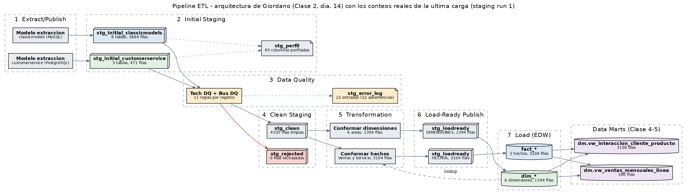

# Las capas de la solución

Referencia rápida para la sustentación. La arquitectura sigue **dos marcos** que se vieron en clase, y conviene no mezclarlos porque responden preguntas distintas:

| Marco | Clase | Pregunta que responde |
|---|---|---|
| Arquitectura de integración de Giordano | Clase 2, diapositivas 14–19 | ¿Por qué etapas pasa un dato desde la fuente hasta el almacén? |
| Flujo dentro del DW: ODS → EDW → DM | Clase 4-5, diapositivas 11–12 | ¿Cómo se organiza el almacén una vez cargado? |



*El diagrama se genera desde la base, con los conteos reales de la última carga (`datawarehouse/ddl/generar_diagramas.py`). No puede contradecir lo que el pipeline hizo.*

---

## 1. Las siete capas de Giordano

El diagrama de la diapositiva 14 tiene **siete columnas**, y cada diapositiva siguiente (15 a 19) tiene una flecha que señala cuál está explicando. La implementación sigue las siete, cada una como tabla física en el schema `staging_dw`:

| # | Capa | Implementación | Dia. | Qué dibuja el diagrama | Filas en la última carga |
|---|---|---|---|---|---|
| 1 | **Extract/Publish** | `MODELOS_EXTRACCION` en `etl_dw_staging.py` | 15 | Un modelo lógico de extracción por fuente | 13 tablas leídas una vez |
| 2 | **Initial Staging** | `stg_initial_classicmodels` · `stg_initial_customerservice` · `stg_perfil` | 16 | Una pila **por fuente**, de colores distintos | 3.864 + 471 = 4.335 · 85 columnas perfiladas |
| 3 | **Data Quality** | `stg_error_log` | 17 | *Tech DQ Checks*, *Bus DQ Check*, *Error Handling* → reporte de *Bad Transactions* | 22 entradas (todas advertencias) |
| 4 | **Clean Staging** | `stg_clean` · `stg_rejected` | **18** | Dos pilas: **gris** (limpios) y **roja** (rechazados) | 4.335 limpias · 0 rechazadas |
| 5 | **Transformation** | `stg_transform` | 19 | *Conform Loan Data*, *Conform Deposit Data*: conformar **por área temática** | 1.394 (dimensiones) + 3.104 (hechos) |
| 6 | **Load-Ready Publish** | `stg_loadready` | — | Una pila lista para cargar | 1.394 + 3.104 |
| 7 | **Load** | `dim_*` · `fact_*` | — | Se bifurca en *Involved Party* y *Event* | 6 dimensiones · 2 hechos |

**En una frase:** las fuentes se leen una vez y aterrizan cada una en su pila, se perfilan, pasan por calidad técnica y de negocio, se separan en limpios y rechazados, se conforman por tema, y se cargan en dos ramas — dimensiones y hechos.

### Qué ocurre en cada capa

**1 · Extract/Publish.** Un modelo de extracción por fuente declara qué tablas se leen. Se traen **las 13**, incluidas `payments` y `cs_customer_products`, que el modelo actual no usa: la diapositiva 15 dice *«traer todo pensando en necesidades futuras»*.

**2 · Initial Staging.** Una tabla por sistema origen, como las pilas de colores del diagrama. La fila se guarda tal como vino, en `JSONB`, sin interpretarla. Después se **perfila** lo que aterrizó (diapositiva 16): nulos, distintos, mínimo y máximo por columna, en cada carga.

**3 · Data Quality.** Es procesamiento, no almacenamiento — en el diagrama no tiene pila propia. Evalúa once reglas por registro, repartidas como las divide la diapositiva 17:

| Clase | Reglas | Qué detecta |
|---|---|---|
| **Técnica** (*Tech DQ Checks*) | `campos_obligatorios`, `tipo_de_dato_valido`, `formato_email` | Datos faltantes y datos inválidos |
| **Negocio** (*Bus DQ Check*) | `integridad_referencial`, `valores_positivos`, `secuencia_de_fechas`, `envio_consistente_con_estado`, `precio_sugerido_coherente`, `cliente_con_vendedor`, `consistencia_entre_fuentes_cliente`, `consistencia_entre_fuentes_producto` | Datos inexactos, definiciones inconsistentes, referencias rotas |

El *Error Handling* escribe cada falla en `stg_error_log`, que es el reporte de *Bad Transactions* que cuelga de la caja en el diagrama (`staging_dw.vw_reporte_transacciones_malas`). Las columnas obligatorias no están escritas en el código: **se leen del repositorio de metadatos** (`db_column.is_nullable`, Entrega 1).

**4 · Clean Staging.** Separa **físicamente**: los registros sin fallas bloqueantes van a `stg_clean` (pila gris) y los demás a `stg_rejected` (pila roja), con sus motivos. La transformación solo puede leer la pila gris.

**5 · Transformation.** Conforma por **área temática**, como las cajas *Conform Loan Data* / *Conform Deposit Data*:

| Área | Destino | Operaciones |
|---|---|---|
| Tiempo | `dim_tiempo` | Generación |
| Organización | `dim_oficina` | Proyección |
| Ventas | `dim_estado_orden` | Agregación de valores distintos |
| Cliente | `dim_cliente` | Join entre fuentes, consolidación |
| Producto | `dim_producto` | Join con `productlines`, join entre fuentes |
| Empleado | `dim_empleado` | Unión de fuentes, llave compuesta |
| Ventas | `fact_ventas` | **Join** (5 tablas), **lookup** (5 dimensiones), **agregaciones** |
| Servicio | `fact_llamadas_servicio` | Lookup (3 dimensiones), medidas calculadas |

`fact_ventas` es el caso donde aparecen juntas las tres operaciones de la diapositiva 19.

**6 · Load-Ready Publish.** La fila en su forma definitiva. Entre esta capa y el destino no queda nada por transformar.

**7 · Load.** La bifurcación final del diagrama en *Involved Party* y *Event* corresponde aquí a **dimensiones** y **hechos**, y cada rama es un proceso aparte (`etl_dw_dimensions.py`, `etl_dw_facts.py`).

---

## 2. ODS → EDW → DM

La diapositiva 12 de la Clase 4-5 dibuja el flujo *dentro* del almacén, y la 11 caracteriza cada depósito:

| Depósito | Detalle | Alcance | En este proyecto |
|---|---|---|---|
| **ODS** | Máximo nivel de detalle | Empresa, día a día | **No se implementa** (ver abajo) |
| **EDW** | Detalle y agregaciones | Empresa | El modelo estrella del schema `public`: `dim_*` y `fact_*` |
| **DM** | Agregaciones, poco detalle | Tema específico | El schema `dm`: dos data marts |

La flecha EDW → DM está rotulada **«Agregar. Segregar»**, y los dos data marts hacen exactamente eso:

| Data mart | Agrega | Segrega |
|---|---|---|
| `dm.vw_interaccion_cliente_producto` | De línea y llamada a cliente × producto × mes | El tema servicio frente a ventas |
| `dm.vw_ventas_mensuales_linea` | De línea de orden a mes × línea de producto | Solo ventas efectivas |

**Por qué no hay ODS.** Un ODS sirve para consulta operativa del día a día sobre dato integrado y reciente. Este proyecto es un pipeline batch sobre dos snapshots estáticos: no hay operación diaria que consultar. La capa Clean Staging contiene el dato integrado y validado antes del EDW, pero no se expone para consulta, y llamarla ODS sería forzar el término.

---

## 3. Cómo se relacionan los dos marcos

```
 FUENTES        GIORDANO (schema staging_dw)                         EDW (public)     DM (dm)
 ──────────     ─────────────────────────────────────────────        ────────────     ───────────

 classicmodels ─► 1 Extract ─► 2 stg_initial_classicmodels ─┐
                                                            ├─► 3 Data Quality
 customerservice ► 1 Extract ─► 2 stg_initial_customerservice┘       │
                                                              ┌──────┴──────┐
                                                        4 stg_clean   stg_rejected
                                                              │
                                                   5 Transformation (conformar)
                                                     ┌────────┴────────┐
                                             6 load-ready          6 load-ready
                                                     │                  │
                                             7 dim_* ───lookup───► 7 fact_* ──► data marts
```

Giordano describe **cómo llega** el dato; ODS/EDW/DM describe **cómo se organiza** una vez adentro. La capa 7 de Giordano es el EDW; los data marts se construyen encima.

---

## 4. Los principios que gobiernan el diseño

**«Read once, write many»** (diapositiva 15). Las 13 tablas se leen **una sola vez** por carga. Las ramas de dimensiones y de hechos no se conectan a las fuentes: leen la misma pila de limpios. Es verificable en la trazabilidad: ambas ramas declaran `run_origen = 1`.

**«Traer todo»** (diapositiva 15). Se extraen también las tablas que hoy no se usan. El modelo puede crecer sin volver a tocar la fuente.

**«Almacenamiento no volátil»** (diapositiva 16). Ninguna tabla de staging se trunca. Cada corrida agrega filas con su `run_id`, incluidas las que fallan.

**«Perfilamiento»** (diapositiva 16). Cada carga perfila lo que aterrizó, no solo la Entrega 1.

---

## 5. Evidencia

```sql
SELECT * FROM staging_dw.vw_trazabilidad_capas;
```

| run_id | proceso | run_origen | initial | errores DQ | clean | rejected | transform | load-ready |
|---|---|---|---|---|---|---|---|---|
| 1 | staging | — | 4.335 | 22 | 4.335 | 0 | — | — |
| 2 | dimensiones | 1 | — | — | — | — | 1.394 | 1.394 |
| 3 | hechos | 1 | — | — | — | — | 3.104 | 3.104 |

**Cero rechazados es la verdad sobre estos datos.** No hay referencias rotas, valores negativos ni fechas incoherentes. Las 22 advertencias son los clientes sin vendedor asignado: la fuente admite el nulo, el negocio no lo espera.

**Y el camino de rechazo está probado.** Como los datos reales no lo ejercitan, `datawarehouse/queries/probar_calidad.py` arma un lote sintético con un defecto por cada tipo de regla y verifica que cada uno termine donde debe: 7 bloqueantes en la pila roja, 4 advertencias como limpios, ningún registro sano marcado. Corre como paso del pipeline.

---

## 6. Sobre los tres destinos de la diapositiva 18

La diapositiva 18 dice *«separar: datos limpios, por revisar y rechazados»*. Aquí hay **dos** pilas, por decisión.

«Por revisar» presupone un **custodio de datos** que valide los casos dudosos antes de cada carga. Este almacén se reconstruye desatendido desde snapshots estáticos: nadie atendería esa cola, y un estado que nadie revisa es una capa muerta. Los casos dudosos pasan como limpios y quedan trazados como `ADVERTENCIA` en el reporte. Si las fuentes pasaran a ser feeds vivos con calidad variable, el tercer estado sí se justificaría.

---

## Dónde está cada cosa

| Qué | Archivo |
|---|---|
| Tablas de las 7 capas, mapeadas a su diapositiva | `datawarehouse/ddl/02_staging_dw.sql` |
| Data marts | `datawarehouse/ddl/03_data_marts.sql` |
| Capas 1 a 4 | `datawarehouse/etl/etl_dw_staging.py` |
| Capas 5 a 7, rama dimensiones | `datawarehouse/etl/etl_dw_dimensions.py` |
| Capas 5 a 7, rama hechos | `datawarehouse/etl/etl_dw_facts.py` |
| Prueba del camino de rechazo | `datawarehouse/queries/probar_calidad.py` |
| Diagrama del pipeline | `docs/Entrega_2/img/pipeline_capas.png` |
