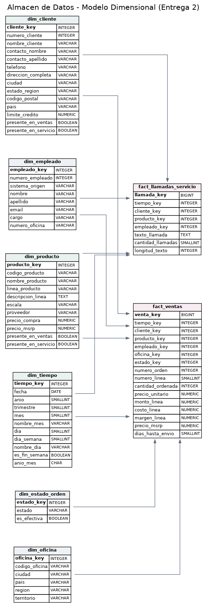
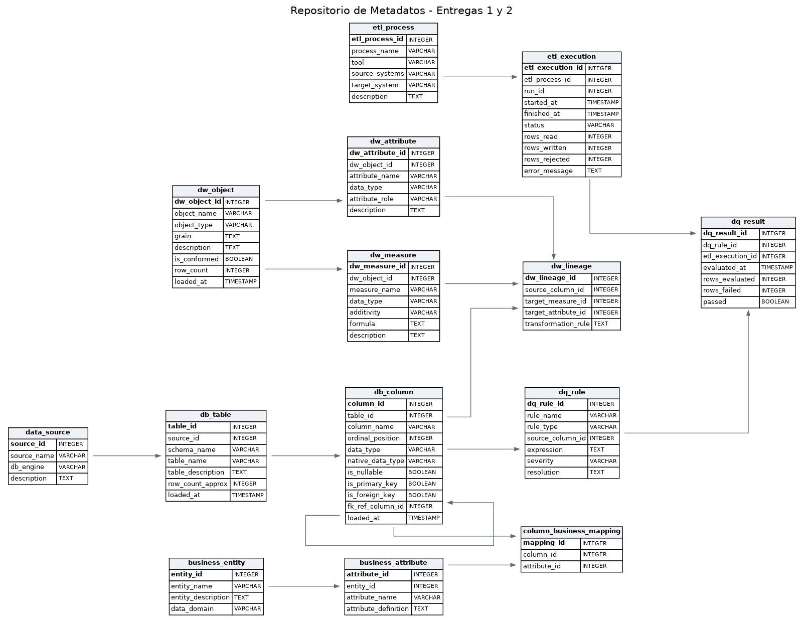

# Documento de Entrega 2 — Proyecto Final

**Pontificia Universidad Javeriana — Modelos y Persistencia de Datos — 2026-01**

Elaborado por: Luis Daniel Sierra Pineda, David Cortes, Salomón Saenz

---

## Resumen ejecutivo

Esta entrega construye una solución de Inteligencia de Negocios sobre las dos fuentes del proyecto: `classicmodels` (MySQL, ventas) y `customerservice` (PostgreSQL, centro de atención al cliente). El resultado es un almacén de datos dimensional que permite analizar ventas y servicio de forma conjunta, algo que ninguna de las dos fuentes hace por sí sola.

El documento sigue las cinco secciones de la rúbrica:

| Sección | Peso | Artefactos que la respaldan |
|---|---|---|
| 1. Diseño físico del almacén y la base dimensional | 25 % | `datawarehouse/ddl/01_dw_schema.sql`, `docs/Entrega_2/img/dw_modelo_dimensional.png` |
| 2. Desarrollo de la solución | 25 % | `datawarehouse/`, `datawarehouse/queries/validacion.py` |
| 3. Diseño de metadatos | 15 % | `metadata_repository/ddl/metadata_dw_extension.sql`, `docs/Entrega_2/img/repositorio_metadatos.png` |
| 4. Diseño de ETLs | 15 % | `datawarehouse/etl/etl_dw_dimensions.py`, `etl_dw_facts.py` |
| 5. Diseño de reportes | 20 % | `reports/construir_dashboard.py`, capturas en `docs/Entrega_2/img/` |

---

## 1. Diseño físico del almacén y la base dimensional (25 %)

### 1.1 El hecho diseñado y por qué

El enunciado pide diseñar un hecho relevante para la toma de decisiones. El hecho principal es **`fact_ventas`**, al grano de **una línea de una orden de compra**. Es el grano más fino disponible en la fuente transaccional y, por lo tanto, el que permite el mayor número de análisis sin perder detalle.

Junto a él se modeló **`fact_llamadas_servicio`**, al grano de **una llamada al centro de servicio**. No se fusionaron en una sola tabla porque tienen granos distintos: una venta no es una llamada, y mezclarlas produciría medidas sin sentido.

Lo que los une son las **dimensiones conformadas**. Esta es la razón de fondo del diseño: el perfilamiento de la Entrega 1 midió que `customers`/`cs_customers` y `products`/`cs_products` solapan al **100 %** en su llave de negocio. Al compartir `dim_cliente`, `dim_producto` y `dim_tiempo`, los dos hechos se pueden consultar en una misma pregunta. Esta configuración —varios hechos que comparten dimensiones— se conoce como **constelación de hechos**.

La pregunta de negocio que motiva el diseño es:

> **¿Qué productos generan más llamadas de servicio por unidad vendida?**

Un valor alto señala productos que producen fricción de postventa desproporcionada frente a lo que facturan: candidatos a revisión de calidad, de documentación o de descripción en el catálogo. Responderla exige cruzar las dos fuentes, y solo el almacén lo permite.

### 1.2 Diagrama físico



El diagrama se generó con Graphviz a partir del esquema real de la base, no de un dibujo hecho a mano, mediante `datawarehouse/ddl/generar_diagramas.py`. Las tablas rosadas son hechos; las verdes, dimensiones conformadas; las grises, dimensiones exclusivas de una fuente.

### 1.3 Las tablas y su significado

#### Hechos

**`fact_ventas`** — 2.996 filas. Grano: una línea de orden.

| Medida | Fórmula | Aditividad | Significado |
|---|---|---|---|
| `cantidad_ordenada` | `orderdetails.quantityOrdered` | Aditiva | Unidades pedidas en la línea |
| `precio_unitario` | `orderdetails.priceEach` | No aditiva | Precio pactado por unidad; se promedia ponderado, no se suma |
| `monto_linea` | `quantityOrdered * priceEach` | Aditiva | Valor facturado. Es la medida central del almacén |
| `costo_linea` | `quantityOrdered * products.buyPrice` | Aditiva | Costo de adquisición de lo vendido |
| `margen_linea` | `monto_linea - costo_linea` | Aditiva | Utilidad bruta |
| `precio_msrp` | `products.MSRP` | No aditiva | Precio sugerido; permite medir el descuento aplicado |
| `dias_hasta_envio` | `shippedDate - orderDate` | Semi-aditiva | Días entre pedido y despacho. Se promedia; nulo si no se despachó |

Dimensiones degeneradas: `numero_orden` y `numero_linea`. Son identificadores del sistema origen que no justifican una tabla propia, así que viven dentro del hecho.

**`fact_llamadas_servicio`** — 108 filas. Grano: una llamada.

| Medida | Fórmula | Aditividad | Significado |
|---|---|---|---|
| `cantidad_llamadas` | Constante 1 | Aditiva | Contador; permite sumar llamadas en cualquier dimensión |
| `longitud_texto` | `length(cs_customer_calls.text)` | Aditiva | Longitud de la nota del agente, como proxy de complejidad del caso |

Dimensión degenerada: `texto_llamada`.

#### Dimensiones

| Dimensión | Filas | Conformada | Qué representa |
|---|---|---|---|
| `dim_tiempo` | 1.096 | Sí | Un día entre 2003-01-01 y 2005-12-31. Generada, no extraída |
| `dim_cliente` | 122 | Sí | Cliente integrado de las dos fuentes, con banderas de presencia en cada una |
| `dim_producto` | 110 | Sí | Producto integrado, con la línea de producto desnormalizada |
| `dim_empleado` | 53 | No | Vendedores y agentes, separados por `sistema_origen` |
| `dim_oficina` | 7 | No | Sede del representante de ventas. Solo existe en classicmodels |
| `dim_estado_orden` | 6 | No | Estado de la orden; `es_efectiva` distingue la venta cerrada |

### 1.4 Qué elementos de las fuentes nutren el hecho

| Elemento del almacén | Fuente | Tablas que lo alimentan |
|---|---|---|
| `fact_ventas` | classicmodels (MySQL) | `orderdetails` ⋈ `orders` ⋈ `products` ⋈ `customers` ⋈ `employees` |
| `fact_llamadas_servicio` | customerservice (PostgreSQL) | `cs_customer_calls` |
| `dim_cliente` | **Ambas** | `customers` (autoritativa) + `cs_customers` (bandera de presencia) |
| `dim_producto` | **Ambas** | `products` ⋈ `productlines` + `cs_products` (bandera de presencia) |
| `dim_empleado` | **Ambas** | `employees` ∪ `cs_employees`, discriminados por `sistema_origen` |
| `dim_oficina` | classicmodels | `offices` |
| `dim_estado_orden` | classicmodels | Valores distintos de `orders.status` |
| `dim_tiempo` | Ninguna | Generada por código |

### 1.5 Dos decisiones de diseño que vale la pena justificar

**Llaves subrogadas.** Cada dimensión tiene dos llaves: la subrogada (`*_key`, un entero que inventa el almacén) y la de negocio (la que viene de la fuente). Los hechos apuntan a la subrogada. La razón es que la llave de negocio puede cambiar, repetirse entre fuentes o ser un texto largo; la subrogada es estable, compacta y rápida en los joins.

**`dim_empleado` con llave compuesta.** Los 23 empleados de classicmodels y los 30 de customerservice **no comparten ni una sola llave**: el solape medido en la Entrega 1 fue del 0 %. Fusionarlos habría exigido inventar equivalencias inexistentes. La solución fue una llave de negocio compuesta `(numero_empleado, sistema_origen)` con llave subrogada encima, de modo que ambas poblaciones conviven sin colisionar. Esto se verifica en el reporte de carga por agente: solo aparecen los 30 agentes de servicio, nunca los vendedores, pese a que comparten rango de numeración.

---

## 2. Desarrollo de la solución (25 %)

### 2.1 Las capas implementadas

La solución tiene cuatro capas físicas, cada una con una responsabilidad única:

| Capa | Dónde vive | Qué hace |
|---|---|---|
| **Fuentes** | MySQL y PostgreSQL en Railway | Sistemas de registro. No se modifican |
| **Staging** | Schema `staging_dw` dentro de la base `dw` | Zona intermedia auditable del ETL |
| **Almacén** | Base `dw` en PostgreSQL 18 (Railway) | Modelo dimensional consultable |
| **Presentación** | Metabase sobre Docker | Reportes; conecta solo al almacén |

En paralelo, el **repositorio de metadatos** (base `railway`, misma instancia) cataloga las tres primeras capas.

### 2.2 Herramienta y justificación

| Componente | Herramienta | Por qué |
|---|---|---|
| Almacén | PostgreSQL 18 en Railway | Se creó como una **base nueva dentro de la instancia que ya hospedaba el repositorio de metadatos**, lo que evita levantar un cuarto servicio y mantiene el costo en cero |
| ETL | Python 3.11 + SQLAlchemy 2.1 + pandas 3.0 | Mismo stack de la Entrega 1: coherencia entre entregas y reutilización del patrón por capas |
| Diagramas | Graphviz en contenedor Docker | Genera el diagrama desde el esquema real, sin instalar Graphviz en las máquinas del equipo |
| Reportes | Metabase (open source) sobre Docker | Cero costo, cero instalación, conecta nativo a PostgreSQL |

Se evaluó y se descartó AWS: ningún punto del enunciado exige nube, Redshift no está habilitado en la cuenta disponible y una instancia RDS habría costado entre 12 y 15 dólares mensuales sin aportar nada a la calificación.

### 2.3 Validación de la carga

La solución no se da por buena porque el ETL termine sin error, sino porque los totales del almacén **cuadran con las fuentes**. `datawarehouse/queries/validacion.py` ejecuta nueve comparaciones:

| Prueba | Fuente | Almacén | Estado |
|---|---|---|---|
| Monto total vendido | 9.604.190,61 | 9.604.190,61 | OK |
| Unidades vendidas | 105.516 | 105.516 | OK |
| Líneas de orden | 2.996 | 2.996 | OK |
| Órdenes distintas | 326 | 326 | OK |
| Llamadas de servicio | 108 | 108 | OK |
| Clientes | 122 | 122 | OK |
| Productos | 110 | 110 | OK |
| Oficinas | 7 | 7 | OK |
| Empleados (ambas fuentes) | 53 | 53 | OK |

Adicionalmente se verificó que el **backup restaura de verdad**: se creó una base desechable, se cargó `dw_backup.sql` y se compararon los conteos y el monto total contra el almacén original. Coincidieron en todo.

---

## 3. Diseño de metadatos (15 %)

### 3.1 Qué se agregó y por qué

El repositorio de la Entrega 1 tenía seis tablas que describen las **fuentes**. Para gestionar un almacén hacen falta tres cosas más: saber qué objetos lo componen, de dónde sale cada dato, y qué pasó en cada corrida del ETL. Se agregaron **ocho tablas**, para un total de catorce.

| Bloque | Tablas nuevas | Qué resuelve |
|---|---|---|
| Estructura del almacén | `dw_object`, `dw_measure`, `dw_attribute` | Cataloga hechos, dimensiones, vistas, medidas y atributos |
| Linaje | `dw_lineage` | Conecta cada medida o atributo con la columna de origen y la regla de transformación |
| Operación | `etl_process`, `etl_execution` | Registra qué proceso corrió, cuándo, con qué herramienta y cuántas filas movió |
| Calidad | `dq_rule`, `dq_result` | Convierte los hallazgos del perfilamiento en reglas evaluables y guarda su resultado por corrida |

### 3.2 Diagrama físico del repositorio completo



Lo importante del diagrama está en el centro: **`db_column`**, la tabla de la Entrega 1 que cataloga las 85 columnas de las fuentes, se conecta a `dw_lineage` y a `dq_rule`. Gracias a eso el linaje ya no se corta en la frontera de las fuentes, sino que llega hasta el almacén.

### 3.3 El linaje de punta a punta

Encadenando `column_business_mapping` (Entrega 1) con `dw_lineage` (Entrega 2), una sola consulta responde de dónde viene cada dato y qué significa en el negocio:

| Fuente | Columna de origen | Objeto del almacén | Destino | Entidad de negocio | Regla |
|---|---|---|---|---|---|
| classicmodels | `customers.customerNumber` | `dim_cliente` | `numero_cliente` | Cliente | Llave de negocio, copia directa |
| classicmodels | `customers.addressLine1` | `dim_cliente` | `direccion_completa` | Cliente | Concatenación con `addressLine2` |
| customerservice | `cs_customers.customernumber` | `dim_cliente` | `presente_en_servicio` | Cliente | Bandera de presencia |
| classicmodels | `orderdetails.quantityOrdered` | `fact_ventas` | `cantidad_ordenada` | Orden de Compra | Copia directa |
| classicmodels | `products.buyPrice` | `fact_ventas` | `costo_linea` | Producto | Cálculo |

### 3.4 Contenido actual del catálogo

| Tabla | Filas | Contenido |
|---|---|---|
| `dw_object` | 9 | 2 hechos, 6 dimensiones, 1 vista |
| `dw_measure` | 9 | Medidas con su aditividad y fórmula |
| `dw_attribute` | 68 | Atributos con su rol |
| `dw_lineage` | 46 | Vínculos fuente → almacén |
| `etl_process` | 2 | Los dos procesos ETL, con herramienta declarada |
| `etl_execution` | 2 | Bitácora de corridas |
| `dq_rule` | 8 | Los hallazgos de la Entrega 1, formalizados |
| `dq_result` | 7 | Su evaluación en la última corrida |

El catálogo se puebla automáticamente con `metadata_repository/etl/etl_dw_metadata.py`, que introspecciona el esquema real del almacén. Solo el linaje se declara a mano, porque es conocimiento de negocio que no se puede deducir del esquema.

---

## 4. Diseño de ETLs (15 %)

### 4.1 Arquitectura del proceso

Se construyeron dos procesos, que siguen el patrón por capas de Anthony Giordano (*Data Integration Blueprint and Modeling*) ya usado en la Entrega 1:

| Proceso | Archivo | Qué carga |
|---|---|---|
| `etl_dw_dimensions` | `datawarehouse/etl/etl_dw_dimensions.py` | Las seis dimensiones |
| `etl_dw_facts` | `datawarehouse/etl/etl_dw_facts.py` | Los dos hechos y la vista integrada |

**El orden no es negociable:** los hechos apuntan a las dimensiones por llave foránea, así que las dimensiones tienen que existir antes. Si se invierte, la base rechaza las filas.

La técnica específica del ETL dimensional es la **búsqueda de llaves subrogadas**: el hecho no guarda `customerNumber = 103`, guarda `cliente_key = 7`, que es la fila que le tocó a ese cliente en `dim_cliente`. El proceso construye un diccionario de traducción por dimensión y lo aplica antes de escribir. Si alguna llave obligatoria queda sin resolver, el proceso **falla en vez de cargar datos huérfanos**.

### 4.2 Registro en el repositorio de metadatos

Cada corrida abre una fila en `etl_execution` con estado `EN_CURSO`, y la cierra con `OK` o `ERROR` más los conteos de filas leídas y escritas. La última corrida registró:

| Proceso | Corrida | Estado | Filas leídas | Filas escritas | Duración |
|---|---|---|---|---|---|
| `etl_dw_dimensions` | 1 | OK | 530 | 1.394 | 20,1 s |
| `etl_dw_facts` | 1 | OK | 3.104 | 3.104 | 18,6 s |

### 4.3 Los problemas de calidad de la Entrega 1, resueltos

El enunciado pide explícitamente resolverlos. Cada uno se trató en la capa Transform y quedó registrado como regla evaluada:

| Hallazgo | Evaluadas | Afectadas | Tratamiento en el ETL |
|---|---|---|---|
| `productlines.htmlDescription` e `image` 100 % nulas | 2 | 2 | Excluidas del almacén; solo se trae `textDescription` |
| Empleados sin llave común entre fuentes | 53 | 0 | Llave compuesta `(numero_empleado, sistema_origen)` |
| `customers.addressLine2` 81,97 % nula | 122 | 100 | Consolidada con `addressLine1` en `direccion_completa` |
| `orders.comments` 75,46 % nula | — | — | Texto libre sin valor analítico: no entra al hecho |
| `orders.shippedDate` nula sin despacho | 2.996 | 141 | `dias_hasta_envio` queda nulo; `dim_estado_orden` explica el motivo |
| Nombres en minúscula en PostgreSQL frente a camelCase en MySQL | 85 | 85 | Normalización de nombres en la capa Transform |
| Órdenes canceladas mezcladas con despachadas | 6 | 3 | Se cargan todas; `es_efectiva` permite excluirlas del reporte |

La columna «afectadas» sale de `dq_result`, no de una estimación: es lo que midió el ETL al correr.

---

## 5. Diseño de reportes (20 %)

### 5.1 Herramienta

**Metabase** (open source) desplegado en un contenedor Docker con volumen persistente. Se eligió por costo cero, cero instalación y conexión nativa a PostgreSQL.

Los reportes se construyeron mediante la **API REST de Metabase** (`reports/construir_dashboard.py`), de modo que el montaje es reproducible: cualquiera del equipo levanta el contenedor, corre el script y obtiene el mismo dashboard.

### 5.2 Cumplimiento de la restricción del enunciado

> «No se conecte a las fuentes de datos originales, debe conectar a su tabla de hecho del almacén de datos.»

El único origen registrado en Metabase es la base **`dw`**. Ni `classicmodels` ni `customerservice` están configurados como orígenes. Todas las consultas de los reportes leen `fact_ventas`, `fact_llamadas_servicio` o la vista `vw_interaccion_cliente_producto`.

### 5.3 Los reportes

| # | Reporte | Qué muestra | Tablas del almacén |
|---|---|---|---|
| 1 | Ventas y margen por mes | Evolución mensual, solo órdenes efectivas | `fact_ventas` ⋈ `dim_tiempo` ⋈ `dim_estado_orden` |
| 2 | **Intensidad de servicio por producto** | Llamadas por unidad vendida | `vw_interaccion_cliente_producto` |
| 3 | Margen por línea de producto | Monto y margen por familia | `fact_ventas` ⋈ `dim_producto` |
| 4 | Clientes: compras frente a llamadas | Dispersión de cada cliente | `vw_interaccion_cliente_producto` |
| 5 | Ventas por oficina | Monto por sede del representante | `fact_ventas` ⋈ `dim_oficina` |
| 6 | Carga del centro de servicio por agente | Llamadas atendidas por agente | `fact_llamadas_servicio` ⋈ `dim_empleado` |

El **reporte 2 es el central** de la entrega: es el único que cruza las dos fuentes, y solo es posible porque `dim_cliente` y `dim_producto` son conformadas. Los resultados sitúan a *American Airlines: B767-300* a la cabeza, con 0,0078 llamadas por unidad vendida, seguido de *1962 City of Detroit Streetcar* con 0,0062.

El **reporte 6 sirve de verificación del modelo**: muestra únicamente los 30 agentes de `customerservice`, nunca los 23 vendedores de `classicmodels`, pese a compartir rango de numeración. Es la evidencia de que la llave compuesta de `dim_empleado` funciona.

---

## 6. Entregables

| Entregable | Ubicación | Herramienta |
|---|---|---|
| Documento (este archivo) | `docs/Entrega_2/Documento_Entrega_2.md` | — |
| **Backup del almacén** | `datawarehouse/backup/dw_backup.sql` | Script propio en Python con SQLAlchemy |
| **Backup del repositorio de metadatos** | `metadata_repository/backup/metadata_repo_backup.sql` | Script propio en Python con SQLAlchemy |
| **Archivos ETL** | `datawarehouse/etl/etl_dw_dimensions.py`, `etl_dw_facts.py`, `metadata_repository/etl/etl_dw_metadata.py` | Python 3.11 + SQLAlchemy 2.1 + pandas 3.0 |
| **Reporte** | `reports/construir_dashboard.py` + capturas en `docs/Entrega_2/img/` | Metabase sobre Docker |
| DDL del almacén | `datawarehouse/ddl/01_dw_schema.sql` | PostgreSQL 18 |
| DDL de la extensión de metadatos | `metadata_repository/ddl/metadata_dw_extension.sql` | PostgreSQL 18 |
| Consultas de negocio | `datawarehouse/queries/pregunta_negocio.sql` | SQL |
| Validación contra fuentes | `datawarehouse/queries/validacion.py` | Python |
| Diagramas físicos | `docs/Entrega_2/img/*.png` | Graphviz en Docker |

> **Nota sobre los backups.** No se usó `pg_dump` porque el binario disponible en las máquinas del equipo es de PostgreSQL 15 y el servidor de Railway corre PostgreSQL 18, combinación que `pg_dump` rechaza por incompatibilidad de versión. En su lugar se escribió un generador propio que produce un archivo SQL equivalente y portable. Su funcionamiento se verificó restaurando el backup sobre una base desechable y comparando conteos y totales.

## 7. Cómo reproducir todo

El proyecto se monta completo con un solo comando, en cualquier máquina con Docker y Python 3.9 o superior. No hace falta ninguna cuenta en la nube ni credenciales:

```bash
git clone <url-del-repositorio>
cd PROYECTOFINAL_MODELOS_Y_PERSISTENCIA_DE_DATOS_SALUDA
python run_all.py
```

`run_all.py` levanta el stack de `docker-compose.yml` —las dos fuentes, el repositorio de metadatos, el almacén y Metabase—, restaura las bases desde los dumps de `sources/`, espera a que los motores estén listos y ejecuta los doce pasos del pipeline en orden. Funciona igual en Windows, macOS y Linux.

Al terminar:

| Servicio | Dirección | Acceso |
|---|---|---|
| Reportes (Metabase) | http://localhost:3000 | `grupo@javeriana.edu.co` / `Javeriana2026!` |
| Almacén de datos | `localhost:5434`, base `dw` | `postgres` / `javeriana` |
| Repositorio de metadatos | `localhost:5434`, base `metadata` | `postgres` / `javeriana` |
| classicmodels | `localhost:3307` | `root` / `javeriana` |
| customerservice | `localhost:5433` | `postgres` / `javeriana` |

### 7.1 Pasos sueltos

Cada etapa se puede correr por separado si hace falta:

```bash
python datawarehouse/ddl/run_sql.py datawarehouse/ddl/01_dw_schema.sql   # esquema del almacén
python datawarehouse/etl/etl_dw_dimensions.py                            # dimensiones (primero)
python datawarehouse/etl/etl_dw_facts.py                                 # hechos (después)
python metadata_repository/etl/etl_dw_metadata.py                        # catálogo de metadatos
python datawarehouse/queries/validacion.py                               # validar contra fuentes
python datawarehouse/ddl/generar_diagramas.py                            # diagramas físicos
python datawarehouse/backup/generar_backup.py dw                         # backup del almacén
python datawarehouse/backup/probar_restauracion.py                       # verificar el backup
python reports/construir_dashboard.py                                    # reportes
```

### 7.2 Portabilidad

El mismo código corre contra el stack local de Docker o contra un servidor remoto: lo único que cambia son las cadenas de conexión del archivo `.env`, que no se versiona. El repositorio incluye `.env.example` con los valores del stack local, y `run_all.py` lo copia automáticamente la primera vez.

`reports/construir_dashboard.py` detecta cuál de los dos casos aplica: si el almacén está en `localhost`, traduce la dirección al nombre del servicio dentro de la red de Docker (`postgres-dw:5432`), porque Metabase corre en un contenedor y no alcanza el `localhost` de la máquina anfitriona; si el almacén es remoto, usa la cadena tal cual y activa SSL.

El detalle paso a paso, pensado para quien nunca ha construido un almacén de datos, está en `docs/Entrega_2/GUIA_PASO_A_PASO.md`.
