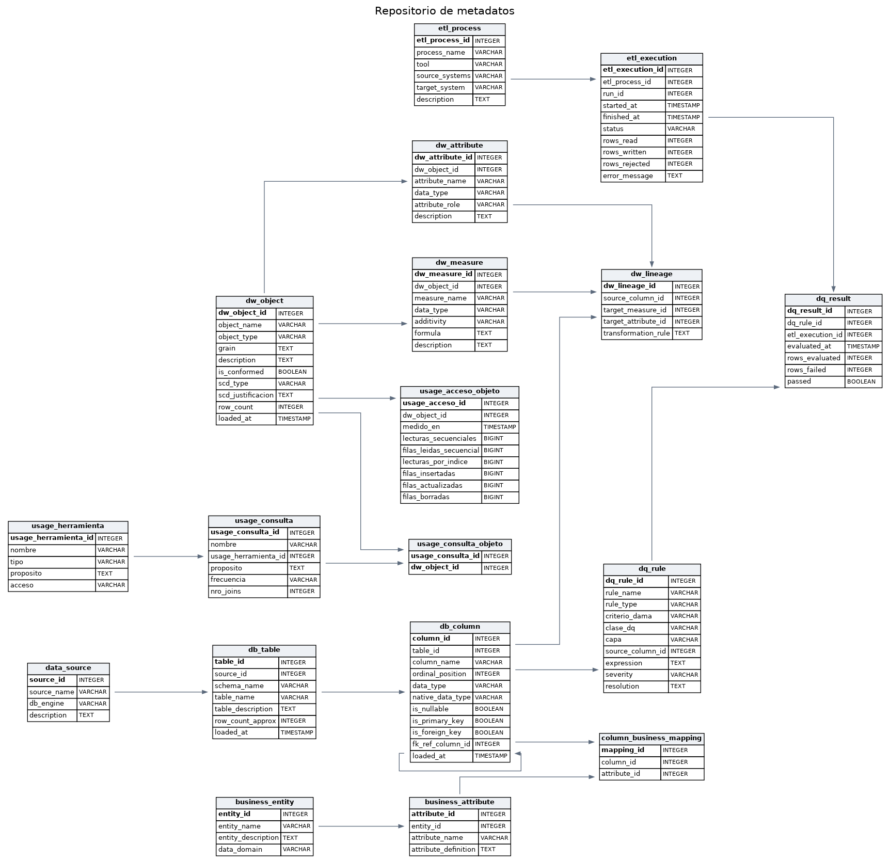

# Repositorio de metadatos

Base PostgreSQL `metadata` que describe las dos fuentes, el glosario de negocio, el almacén de datos, los procesos que lo cargan, la calidad de los datos y el uso del almacén. Tiene 18 tablas en el schema `public` y un schema `staging` con las etapas del ETL de metadatos técnicos.



## Modelo

| Categoría | Tablas | Quién las llena |
|---|---|---|
| Técnicos de las fuentes | `data_source`, `db_table`, `db_column` | `etl/etl_source_metadata.py` |
| Negocio | `business_entity`, `business_attribute` | `seeds/business_metadata.sql` |
| Linaje semántico | `column_business_mapping` (columna técnica ↔ atributo de negocio) | `seeds/business_metadata.sql` |
| Técnicos del almacén | `dw_object`, `dw_measure`, `dw_attribute` | `etl/etl_dw_metadata.py` |
| Linaje fuente → almacén | `dw_lineage` | `etl/etl_dw_metadata.py` |
| Procesos | `etl_process`, `etl_execution` | Cada corrida del pipeline que carga el almacén (`pipeline/common.py`) |
| Calidad | `dq_rule` (catálogo), `dq_result` (resultado por corrida) | `seeds/dq_rules.sql` y cada corrida del ETL del almacén |
| Uso | `usage_herramienta`, `usage_consulta`, `usage_consulta_objeto`, `usage_acceso_objeto`, vista `vw_perfil_uso` | `etl/etl_usage_metadata.py` |

El núcleo de la Entrega 1 son las seis primeras tablas ([`docs/img/metadata_core_erd.png`](../docs/img/metadata_core_erd.png)). `db_column` es el punto de unión de todo el modelo: de ella salen el linaje hacia el negocio (`column_business_mapping`), el linaje hacia el almacén (`dw_lineage`) y las reglas de calidad asociadas a una columna (`dq_rule.source_column_id`).

## Archivos

| Archivo | Contenido |
|---|---|
| [`ddl/01_core_schema.sql`](ddl/01_core_schema.sql) | Tablas de metadatos técnicos, de negocio y de linaje semántico |
| [`ddl/02_etl_staging.sql`](ddl/02_etl_staging.sql) | Schema `staging` del ETL de metadatos técnicos |
| [`ddl/03_dw_extension.sql`](ddl/03_dw_extension.sql) | Tablas del almacén, linaje, procesos y calidad |
| [`ddl/04_usage_extension.sql`](ddl/04_usage_extension.sql) | Tablas y vista de metadatos de uso |
| [`seeds/business_metadata.sql`](seeds/business_metadata.sql) | 8 entidades de negocio, 47 atributos y 78 vínculos de linaje semántico |
| [`seeds/dq_rules.sql`](seeds/dq_rules.sql) | Catálogo de 20 reglas de calidad |
| [`etl/etl_source_metadata.py`](etl/etl_source_metadata.py) | ETL de metadatos técnicos de las fuentes |
| [`etl/etl_dw_metadata.py`](etl/etl_dw_metadata.py) | Catálogo del almacén y linaje fuente → almacén |
| [`etl/etl_usage_metadata.py`](etl/etl_usage_metadata.py) | Metadatos de uso declarados y medidos |
| [`queries/required_questions.sql`](queries/required_questions.sql) | Las seis consultas del enunciado de la Entrega 1 |
| [`queries/lineage_and_impact.sql`](queries/lineage_and_impact.sql) | Linaje de datos, análisis de impacto y cobertura del linaje |
| [`backup/metadata_repo_backup.sql`](backup/metadata_repo_backup.sql) | Backup del schema `public` con todos los datos |

## ETL de metadatos técnicos

`etl_source_metadata.py` lee el diccionario de datos de las dos fuentes con `SQLAlchemy.inspect()` y lo lleva al repositorio en cinco etapas. Cada etapa escribe su propia tabla en el schema `staging`, identificada por un `run_id`, y la siguiente lee de ahí:

| Etapa | Función | Tabla | Qué hace |
|---|---|---|---|
| Extract | `extract()` | `staging.stg_extract` | Copia tabla, columna, tipo nativo, nulabilidad, PK, FK y conteo de filas de las 13 tablas (85 columnas) |
| Data Quality | `data_quality()` | `staging.stg_dq` | Marca `OK` o `RECHAZADO`: nombres vacíos, PK que admite nulos, filas duplicadas |
| Transform | `transform()` | `staging.stg_transform` | Normaliza el tipo entre motores (conserva el nativo en `native_data_type`) y agrega la descripción de negocio de cada tabla |
| Load Ready Publish | `load_ready_publish()` | `staging.stg_loadready` | Forma final de la carga |
| Target Load | `load()` | `data_source`, `db_table`, `db_column` | `INSERT ... ON CONFLICT DO UPDATE`; en una segunda pasada resuelve `fk_ref_column_id` |

## Metadatos de negocio y linaje semántico

`seeds/business_metadata.sql` se ingresa a mano y es idempotente. Carga las entidades Cliente, Empleado, Producto, Línea de Producto, Oficina, Orden de Compra, Pago y Llamada de Servicio con su dominio de datos, sus atributos y el mapeo de cada columna fuente al atributo que representa. Antes de insertar verifica que `db_column` ya esté cargada; al final advierte si alguno de los 78 vínculos esperados no encontró su columna.

## Metadatos del almacén

`etl_dw_metadata.py` reconstruye el catálogo en cada corrida introspeccionando la base `dw`:

- `dw_object`: 2 hechos, 6 dimensiones y 2 vistas de data mart, con grano, descripción, si la dimensión es conformada, tipo de dimensión lentamente cambiante (todas son tipo 1, con su justificación en `scd_justificacion`) y conteo de filas.
- `dw_measure`: las 9 medidas con su aditividad (`ADITIVA`, `SEMI_ADITIVA`, `NO_ADITIVA`) y fórmula.
- `dw_attribute`: el resto de columnas con su rol (`SURROGATE_KEY`, `BUSINESS_KEY`, `FOREIGN_KEY`, `DESCRIPTIVE`, `FLAG`, `DEGENERATE`).
- `dw_lineage`: 48 vínculos columna fuente → campo del almacén con su regla de transformación.

## Calidad de datos

`dq_rule` cataloga 20 reglas, cada una con su tipo, dimensión de calidad (`criterio_dama`), clase técnica o de negocio (`clase_dq`), capa donde se evalúa, severidad y resolución:

| Capa | Reglas | Dónde se evalúa |
|---|---|---|
| `DATA_QUALITY` | 11 | Registro por registro en `pipeline/layer3_data_quality.py`; las bloqueantes rechazan el registro |
| `TRANSFORMATION` | 8 | En `layer5_transform_dimensions.py` y `layer5_transform_facts.py`; documentan cómo el modelo resuelve un hallazgo del perfilamiento |
| `MONITOREO` | 1 | `almacen_frescura_de_carga` está catalogada pero ningún proceso la evalúa todavía |

Cada corrida del ETL guarda en `dq_result` cuántas filas evaluó cada regla y cuántas fallaron. Con los datos originales ninguna regla bloqueante falla; la única advertencia de la capa `DATA_QUALITY` es `cliente_con_vendedor` (22 clientes sin representante).

## Metadatos de uso

`etl_usage_metadata.py` declara las 3 herramientas que acceden al almacén (Metabase, el ETL y los scripts de validación y backup) y las 8 consultas conocidas con su frecuencia, número de joins y los objetos que leen. Además copia los contadores de `pg_stat_user_tables` del almacén a `usage_acceso_objeto` (lecturas secuenciales, lecturas por índice, filas insertadas, actualizadas y borradas). La vista `vw_perfil_uso` cruza lo declarado con lo medido.

## Consultas

`queries/required_questions.sql` responde las preguntas de la Entrega 1: tablas por fuente, columnas de una tabla con su tipo y si son PK, glosario de negocio, atributos de una entidad, ubicación física de cada entidad y linaje semántico de `cs_customers`.

`queries/lineage_and_impact.sql` recorre el grafo de linaje completo en las dos direcciones:

1. **Linaje de datos**: cada medida o atributo del almacén con su columna fuente, regla de transformación y entidad y atributo de negocio.
2. **Análisis de impacto**: por cada columna fuente, los objetos y campos del almacén, reportes y reglas de calidad que dependen de ella.
3. Análisis de impacto de una columna concreta (`customers.customerNumber`).
4. **Cobertura**: campos del almacén sin origen declarado y si eso es esperado (llaves subrogadas, `dim_tiempo`, `sistema_origen`).

## Backup

`backup/metadata_repo_backup.sql` lo genera `python tools/generate_backup.py metadata`: el DDL de `ddl/01`, `03` y `04` seguido de los datos de las 18 tablas como `INSERT`. No incluye el schema `staging`, que es el historial de corridas del ETL. Se restaura sobre una base vacía con:

```bash
psql "<url-de-la-base>" -f metadata_repository/backup/metadata_repo_backup.sql
```

`datawarehouse/tests/test_backup_restore.py` lo restaura en una base temporal y compara conteos contra la base real.
